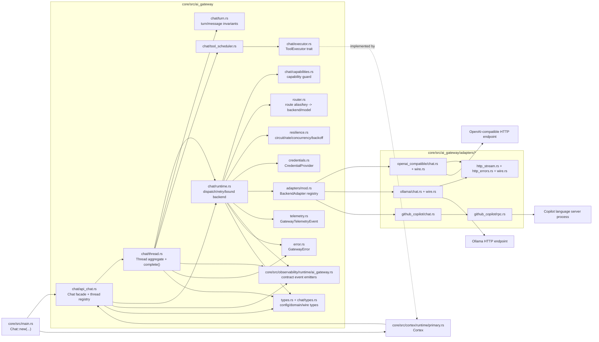

# AI Gateway Topology (Current)

Last verified: 2026-04-06

Source anchors:

- core/src/ai_gateway/*
- core/src/main.rs
- core/src/cortex/runtime/primary.rs
- core/tests/ai_gateway/*

## Module Topology

## Request Flow Used Today (Complete Path)

1. `core/src/main.rs` constructs `Chat::new(config.ai_gateway, EnvCredentialProvider)` and injects `Arc<Chat>` into `Cortex::from_config`.
2. `core/src/cortex/runtime/primary.rs` opens or reuses a thread via `Chat::open_thread`.
3. `Thread::complete` builds `TurnPayload` from system prompt + thread history + input messages + tool config + limits + metadata.
4. `ChatRuntime::dispatch_complete` handles dispatch:
   - `CapabilityGuard::assert_supported`
   - `ResilienceEngine::pre_dispatch` + circuit/rate/concurrency checks
   - `BackendAdapter::complete` on selected adapter
   - retry/backoff through `ResilienceEngine::can_retry`
   - telemetry and observability event emission
5. `Thread::complete` commits the turn and assistant message to in-memory thread state.
6. If `tool_executor` exists and adapter returns tool calls, `ToolScheduler` executes each call through `ToolExecutor` (implemented by Cortex), appends tool results, and marks `pending_tool_call_continuation = true`.

## Important Current Boundaries

- Runtime surface is object-oriented: `Chat -> Thread -> Turn`.
- `Thread::stream` is currently not implemented and returns `UnsupportedCapability`.
- Adapter contract already exposes both `complete` and `stream`.
  - OpenAI-compatible and Ollama adapters implement both.
  - Copilot adapter `complete` currently consumes its own `stream` output internally.
- Routing is deterministic and config-driven (`AIGatewayConfig.backends[].models[].aliases`) and requires alias `default` to exist.
- Observability is emitted at three levels:
  - request/attempt transport events
  - chat-turn lifecycle events
  - chat-thread snapshot events

## Test Mapping (Current)

- `core/tests/ai_gateway/router.rs`: route alias/key resolution behavior.
- `core/tests/ai_gateway/thread.rs`: context derive/rewrite behavior and turn-id sequencing expectations.
- `core/tests/ai_gateway/turn.rs`: tool call/result linkage invariants and `ToolScheduler` behavior.
