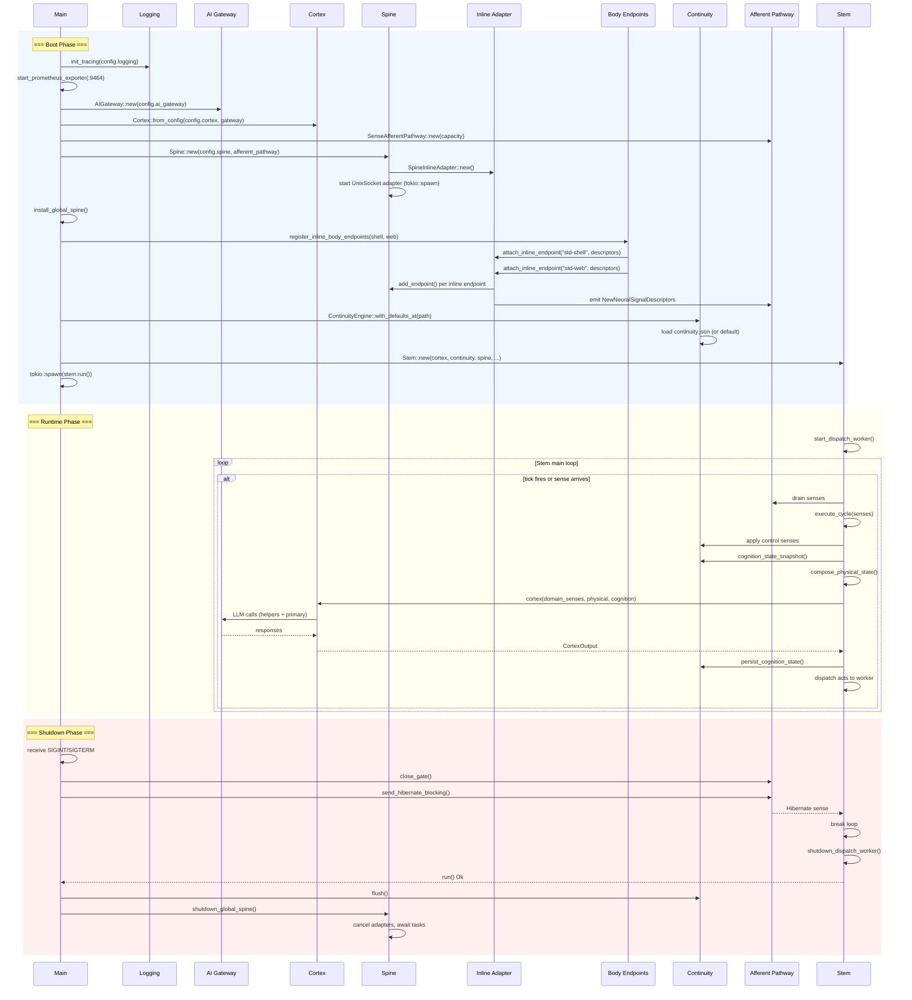
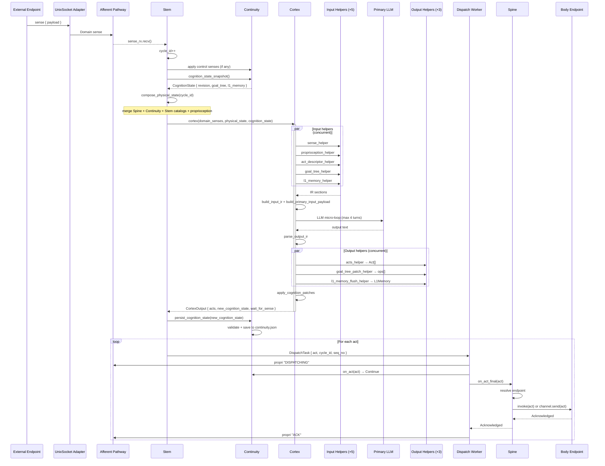

# Core Topography

完整的 Beluna Core 运行时拓扑与交互序列。

---

## System Topography

```
┌─────────────────────────────────────────────────────────────────────────────────────────┐
│                                  Beluna Core Process                                    │
│                                  (core/src/main.rs)                                     │
│                                                                                         │
│   ┌──────────────────────────────────────────────────────────────────────────────────┐   │
│   │                              main()  Boot Sequence                               │   │
│   │  Config::load → init_tracing → start_prometheus_exporter                         │   │
│   │  → AIGateway::new → Cortex::from_config → Spine::new → install_global_spine     │   │
│   │  → register_inline_body_endpoints → ContinuityEngine::with_defaults_at           │   │
│   │  → Stem::new → tokio::spawn(stem.run())                                         │   │
│   │  → await SIGINT/SIGTERM → close_gate → hibernate → join stem → shutdown spine    │   │
│   └──────────────────────────────────────────────────────────────────────────────────┘   │
│                                                                                         │
│   ┌─────────────────────────────────────────────────────────────────────────────────┐    │
│   │                         Afferent Pathway (Sense Queue)                          │    │
│   │                        bounded MPSC, gated sender                               │    │
│   │                                                                                 │    │
│   │  Producers:                                       Consumer:                     │    │
│   │    Body Endpoints (via Spine adapters) ──┐                                      │    │
│   │    Spine dispatch failures ──────────────┤          ┌─────────┐                 │    │
│   │    Stem dispatch worker (propri) ────────┼────────► │  Stem   │                 │    │
│   │    Main shutdown (hibernate) ────────────┤          │  loop   │                 │    │
│   │    Continuity (reserved) ────────────────┘          └─────────┘                 │    │
│   └─────────────────────────────────────────────────────────────────────────────────┘    │
│                                                                                         │
│   ┌──────────────┐     ┌──────────────┐     ┌──────────────┐     ┌────────────────┐     │
│   │     Stem     │────►│   Cortex     │     │  Continuity  │     │    Spine       │     │
│   │              │     │              │     │              │     │                │     │
│   │ tick loop    │     │ cognition    │     │ state owner  │     │ endpoint       │     │
│   │ sense drain  │     │ boundary     │     │ persistence  │     │ routing        │     │
│   │ cortex call  │     │ (stateless)  │     │ guardrails   │     │ dispatch       │     │
│   │ act dispatch │     │              │     │ act gating   │     │ adapter mgmt   │     │
│   └──────┬───────┘     └──────┬───────┘     └──────┬───────┘     └───────┬────────┘     │
│          │                    │                    │                      │              │
│          │ invoke             │ uses               │ middleware           │ routes to    │
│          ├───────────────────►│                    │                      │              │
│          │                    │                    ◄──────────────────────┤              │
│          │ persist            │                    │                      │              │
│          ├───────────────────►├....(no direct)....►│                      │              │
│          │                    │                    │                      │              │
│          │ dispatch: continuity.on_act → spine.on_act_final              │              │
│          ├────────────────────────────────────────►├─────────────────────►│              │
│          │                                         │                      │              │
│   ┌──────┴───────────────────────────────────────┐ │                      │              │
│   │            Dispatch Worker (async)           │ │                      │              │
│   │  Continuity → Continue? → Spine → result     │ │                      │              │
│   │  emit proprioception status patches          │ │                      │              │
│   └──────────────────────────────────────────────┘ │                      │              │
│                                                    │                      │              │
│   ┌──────────────────────┐                         │     ┌───────────────┴────────────┐ │
│   │    AI Gateway        │                         │     │      Body Endpoints        │ │
│   │                      │                         │     │                            │ │
│   │  routing             │                         │     │  ┌─ Inline ─────────────┐  │ │
│   │  normalization       │◄────── Cortex uses ─────┘     │  │  std-shell           │  │ │
│   │  reliability         │                               │  │  std-web             │  │ │
│   │  budget enforcement  │                               │  └──────────────────────┘  │ │
│   │  backend adapters    │                               │                            │ │
│   │  (Anthropic/OpenAI)  │                               │  ┌─ External (UDS) ─────┐  │ │
│   └──────────────────────┘                               │  │  Apple Universal App  │  │ │
│                                                          │  │  CLI                  │  │ │
│   ┌──────────────────────┐     ┌──────────────────────┐  │  │  (any UDS client)     │  │ │
│   │   Observability      │     │    Ledger            │  │  └──────────────────────┘  │ │
│   │                      │     │                      │  │                            │ │
│   │  tracing (JSON file) │     │  survival budget     │  └────────────────────────────┘ │
│   │  stderr mirror       │     │  reserve/settle/     │                                 │
│   │  Prometheus metrics  │     │  refund/expire       │                                 │
│   │  :9464 /metrics      │     │  (awaiting Stem      │                                 │
│   └──────────────────────┘     │   integration)       │                                 │
│                                └──────────────────────┘                                 │
└─────────────────────────────────────────────────────────────────────────────────────────┘
```

---

## Module Dependency Graph

```
main.rs
  │
  ├──► Config              (beluna.jsonc → Config struct)
  ├──► Logging             (tracing init, JSON file + stderr)
  ├──► Observability       (Prometheus metrics exporter)
  ├──► AI Gateway          (LLM backend routing/dispatch)
  ├──► Cortex              (cognition engine, uses AI Gateway)
  ├──► Spine               (endpoint routing, uses Afferent Pathway)
  │     ├──► Inline Adapter   (in-process body endpoints)
  │     └──► UnixSocket Adapter (external body endpoints)
  ├──► Body                (std-shell, std-web, attach via Inline Adapter)
  ├──► Continuity          (cognition persistence + act gating)
  ├──► Stem                (runtime loop, orchestrates all above)
  └──► Afferent Pathway    (shared sense queue)

Dependency direction (arrows = "depends on / calls into"):

  Stem ──────► Cortex ──────► AI Gateway ──────► LLM Providers
    │                              │
    ├──────► Continuity            ├──► Budget Enforcer
    │           │                  ├──► Reliability Layer
    │           └──► Persistence   └──► Backend Adapters (Anthropic, OpenAI)
    │
    ├──────► Spine ──────► Adapters ──────► Body Endpoints
    │           │
    │           └──► Afferent Pathway (dispatch failure senses)
    │
    └──────► Afferent Pathway (proprioception status patches)

Cross-cutting:
  Observability (tracing + metrics) ◄──── all modules emit spans/events
```

---

## File Topography

```
core/src/
├── main.rs                   入口: boot, signal handling, shutdown
├── cli.rs                    CLI 参数解析 (--config)
├── config.rs                 Config 加载 + JSON Schema 验证
├── lib.rs                    crate 公共导出 (for integration tests)
├── types.rs                  共享类型: Sense, Act, NeuralSignalDescriptor, PhysicalState
├── afferent_pathway.rs       SenseAfferentPathway (gated bounded MPSC)
├── logging.rs                tracing 初始化, JSON file appender, retention
├── stem.rs                   Stem runtime loop + dispatch worker
│
├── cortex/                   认知引擎 (stateless boundary)
│   ├── mod.rs, runtime.rs, cognition.rs, cognition_patch.rs
│   ├── ir.rs, prompts.rs, clamp.rs, error.rs, types.rs, testing.rs
│   └── helpers/              8 个认知器官 (input/output helpers)
│
├── continuity/               认知状态持久化 + act 守门
│   ├── mod.rs, engine.rs, state.rs, persistence.rs
│   ├── error.rs, types.rs
│   └── AGENTS.md
│
├── spine/                    执行底座: 路由 + 适配器
│   ├── mod.rs, runtime.rs, endpoint.rs, error.rs, types.rs
│   └── adapters/
│       ├── inline.rs         内置 body endpoint 适配器
│       └── unix_socket.rs    外部 UDS+NDJSON 适配器
│
├── body/                     内置 body endpoints
│   ├── mod.rs                register_inline_body_endpoints()
│   ├── shell.rs              std-shell (tool.shell.exec)
│   ├── web.rs                std-web (tool.web.fetch)
│   └── payloads.rs           ShellLimits, WebLimits
│
├── ai_gateway/               LLM 网关
│   ├── gateway.rs            AIGateway: routing + dispatch + chat
│   ├── router.rs             BackendRouter (route selection)
│   ├── budget.rs             BudgetEnforcer (debit pre-check)
│   ├── reliability.rs        ReliabilityLayer (retry + timeout)
│   ├── request_normalizer.rs
│   ├── response_normalizer.rs
│   ├── capabilities.rs       CapabilityGuard
│   ├── credentials.rs        CredentialProvider trait
│   ├── telemetry.rs          GatewayTelemetryEvent
│   ├── chat/                 ChatGateway, session/thread/turn
│   ├── adapters/             BackendAdapter (Anthropic, OpenAI)
│   ├── types.rs, types_chat.rs, error.rs
│   └── AGENTS.md
│
├── ledger/                   生存预算子系统
│   ├── ledger.rs             SurvivalLedger (reserve/settle/refund/expire)
│   ├── stage.rs              LedgerStage (dispatch integration)
│   └── types.rs
│
└── observability/
    └── metrics.rs            Prometheus gauges/counters + exporter
```

---

## Data Flow Topography

### Sense 流入路径 (Afferent)

```
External Body Endpoint ─── UDS NDJSON ──► UnixSocket Adapter ──┐
                                                                ├──► Afferent Pathway ──► Stem
Inline Body Endpoint ─── Inline Adapter ───────────────────────┘            ▲
                                                                            │
Spine dispatch failures ─── Domain(dispatch.failed) ────────────────────────┤
Stem dispatch worker ─── Proprioception patches ────────────────────────────┤
Main shutdown ─── Hibernate ────────────────────────────────────────────────┘
```

### Sense 类型与处理

```
Sense enum:
  ├─ Domain(SenseDatum)                    → 传递给 Cortex 作为认知输入
  ├─ Hibernate                             → 终止 Stem 循环
  ├─ NewNeuralSignalDescriptors(patch)     → Continuity 应用 capability 补丁 (同周期)
  ├─ DropNeuralSignalDescriptors(drop)     → Continuity 移除 capabilities (同周期)
  ├─ NewProprioceptions(patch)             → Stem 更新 dynamic 属性 (同周期)
  └─ DropProprioceptions(drop)             → Stem 移除 dynamic 属性 (同周期)
```

### Act 流出路径 (Efferent)

```
Cortex ── CortexOutput.acts ──► Stem ──┬── core.control/sleep → Stem sleep mode
                                       │
                                       └── Dispatch Worker ──► Continuity.on_act()
                                                                 ├─ Break → REJECTED
                                                                 └─ Continue
                                                                      │
                                                                      ▼
                                                               Spine.on_act_final()
                                                                 ├─ resolve endpoint
                                                                 ├─ Inline → endpoint.invoke()
                                                                 └─ Adapter → channel.send()
                                                                      │
                                                                      ▼
                                                               Body Endpoint executes
```

### State 流通路径

```
                    ┌────────────── Cognition State ──────────────────┐
                    │  goal_tree (root_partition + user_partition)    │
                    │  l1_memory (Vec<String>)                       │
                    │  revision (u64)                                 │
                    └────────────────────────────────────────────────┘
                         │                           ▲
                         │ snapshot                   │ persist
                         ▼                           │
                    Continuity ◄─────────────── Stem ────────► Cortex
                       │ load/save                        pure fn call
                       ▼                                  (no side effects)
                    continuity.json

                    ┌────────────── Physical State ───────────────────┐
                    │  cycle_id                                       │
                    │  ledger snapshot                                │
                    │  capabilities (merged Spine+Continuity+Stem)   │
                    │  proprioception (merged startup+dynamic)       │
                    └────────────────────────────────────────────────┘
                         │
                         │ composed by Stem each cycle
                         ▼
                       Cortex (read-only input)
```

---

## Sequence Diagram

### 完整运行时生命周期



### 单个 Cognition Cycle（端到端）



### 外部 Body Endpoint 完整生命周期

```mermaid
sequenceDiagram
    participant Ext as External Endpoint
    participant UDS as UnixSocket Adapter
    participant Spine
    participant AP as Afferent Pathway
    participant Stem
    participant Cortex

    Note over Ext, UDS: === Connection ===
    Ext->>UDS: connect (Unix Domain Socket)
    UDS->>Spine: on_adapter_channel_open() → channel_id

    Note over Ext, UDS: === Registration ===
    Ext->>UDS: auth { endpoint_name, capabilities }
    UDS->>Spine: add_endpoint(name, AdapterChannel(ch), descriptors)
    Spine-->>UDS: BodyEndpointHandle { body_endpoint_id }
    UDS->>AP: NewNeuralSignalDescriptors
    Note over Stem: next cycle sees new capabilities in physical_state

    Note over Ext, UDS: === Sense Ingress ===
    Ext->>UDS: sense { endpoint_id, descriptor_id, payload }
    UDS->>AP: Domain(SenseDatum)
    AP-->>Stem: drain → execute_cycle → Cortex

    Note over Ext, UDS: === Act Egress ===
    Cortex-->>Stem: acts targeting this endpoint
    Stem->>Spine: on_act_final(act)
    Spine->>UDS: adapter_channels[ch].send(act)
    UDS->>Ext: NDJSON act line
    Ext->>UDS: act_ack { result }
    UDS->>AP: sense (ack/observation)

    Note over Ext, UDS: === Disconnect ===
    Ext->>UDS: disconnect / connection lost
    UDS->>Spine: on_adapter_channel_closed(channel_id)
    Spine->>Spine: remove all endpoints for channel
    UDS->>AP: DropNeuralSignalDescriptors
    Note over Stem: next cycle no longer sees those capabilities
```


