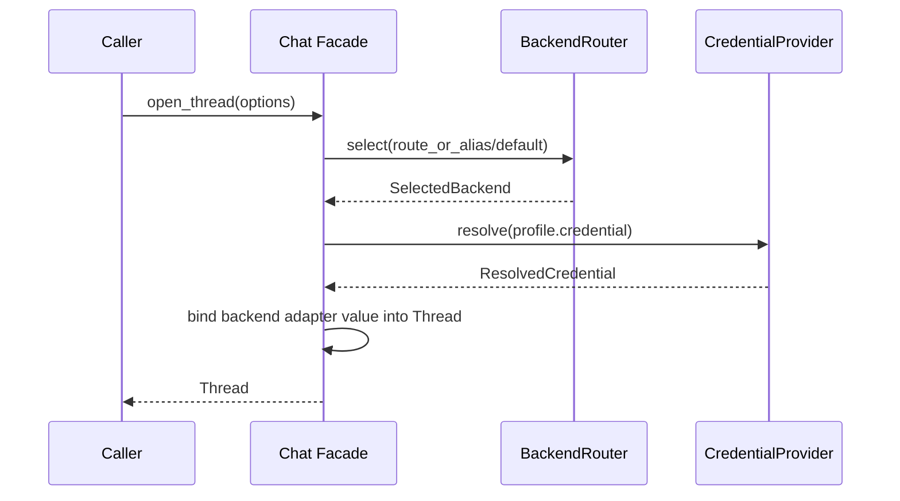
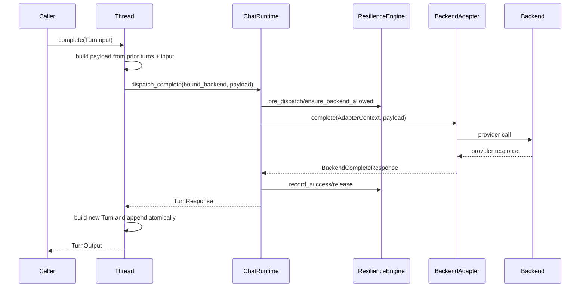
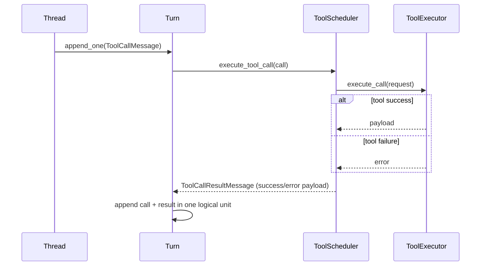
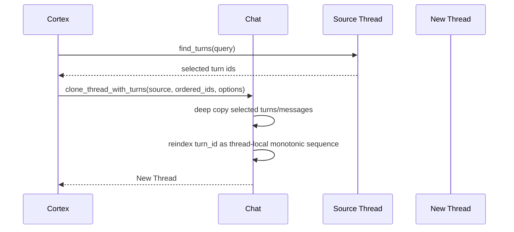

# AI Gateway Chat Sequence

## 1. Open Thread

## 2. Complete Turn

## 3. Tool Call Append Atomicity

## 4. Pick + Clone Thread

## Key Guarantees

- Routing happens only on `open_thread`/`clone_thread_with_turns`.
- Thread backend binding is fixed for the thread lifecycle.
- `Turn` invariants enforce tool call/result linkage completeness.
- Gateway resilience handles retry/backoff/circuit/concurrency/rate/timeout.
- Gateway returns usage data but does not enforce caller budget policy.
