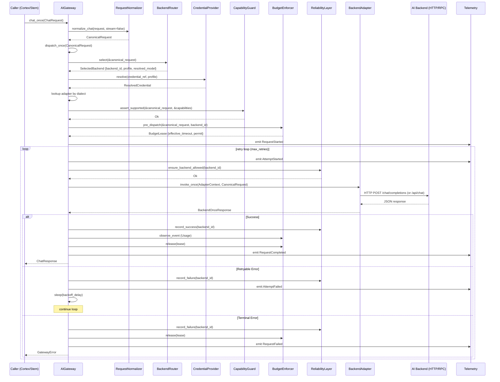
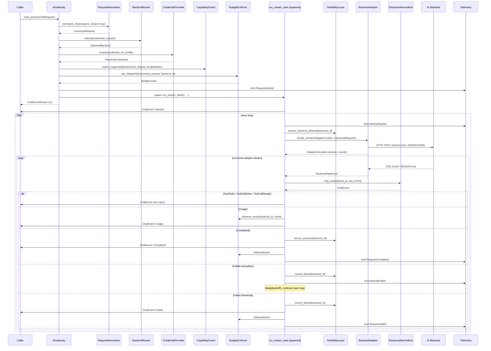
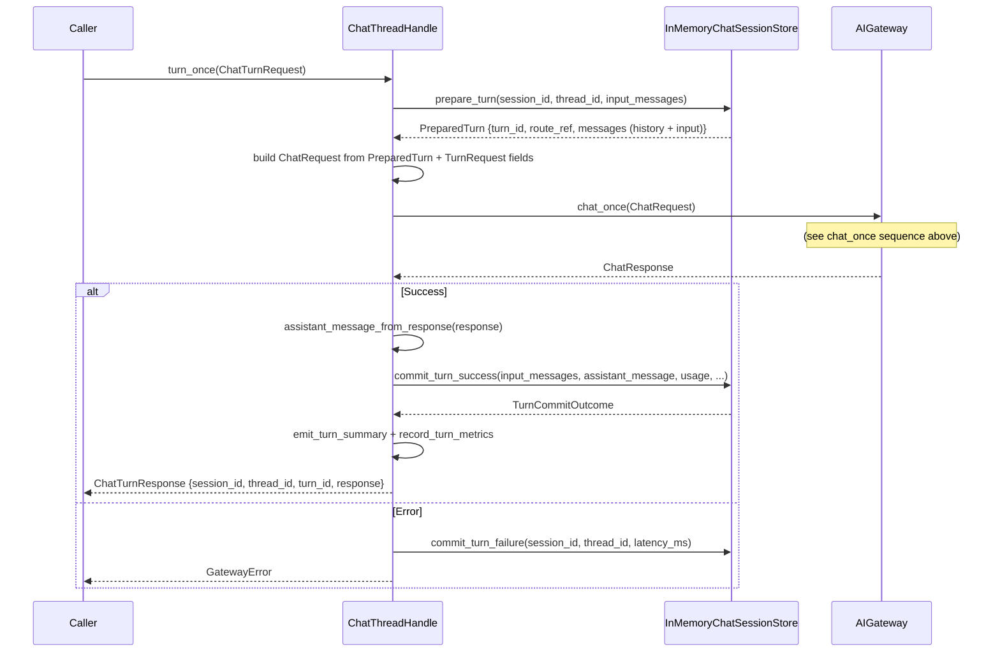

# AI Gateway — Chat Capability Sequence Diagrams

## 1. `chat_once()` — Synchronous Single-Turn



## 2. `chat_stream()` — Streaming



## 3. Chat Session Layer — `turn_once()`



## Key Data Flow Summary

```text
ChatRequest (Beluna types)
  ↓  RequestNormalizer.normalize_chat()
CanonicalRequest (internal canonical types)
  ↓  Router.select() → SelectedBackend
  ↓  CapabilityGuard.assert_supported()
  ↓  BudgetEnforcer.pre_dispatch() → BudgetLease
  ↓  Adapter.invoke_once/invoke_stream(AdapterContext, CanonicalRequest)
  ↓      ↓ http_common: CanonicalMessage → wire JSON
  ↓      ↓ HTTP/RPC to backend
  ↓  BackendRawEvent stream
  ↓  ResponseNormalizer.map_raw()
ChatEvent stream / ChatResponse (Beluna types)
```
