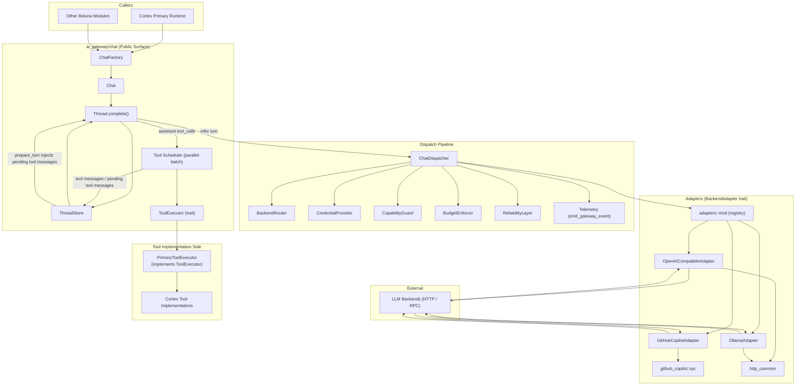
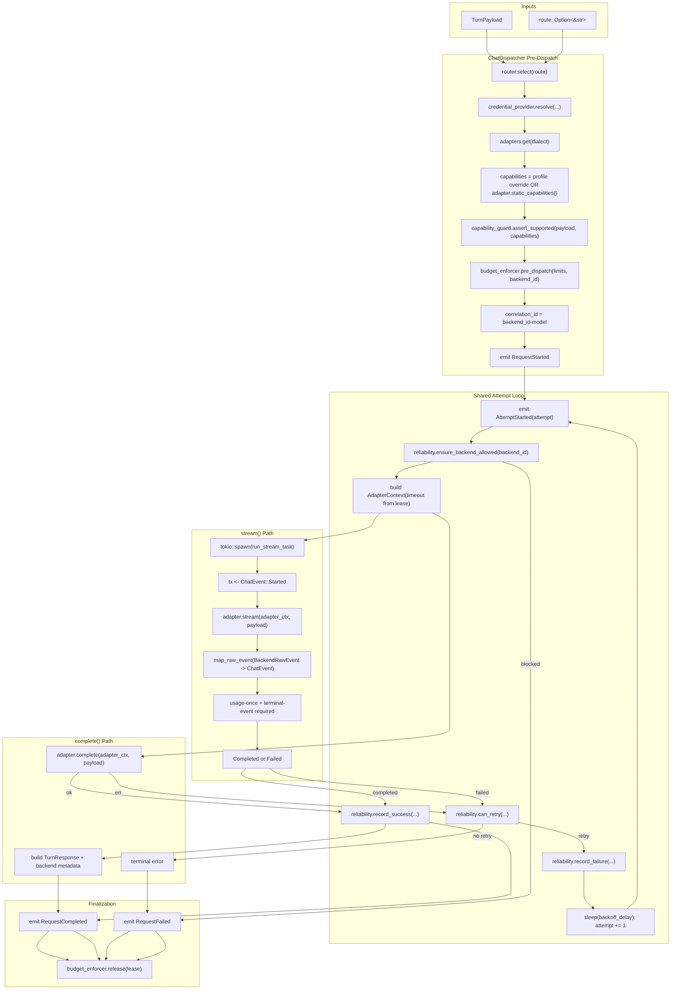

# AI Gateway — Topology

## Component Topology (Mermaid)

## ChatDispatcher Topology (Expanded)

### Dispatcher stage notes

- Route and backend selection is deterministic (`BackendRouter`) and happens once before retries.
- Capability enforcement is request-level (`tools`, `json_object`, `json_schema`, `vision`) and fails fast before adapter calls.
- Budget lease is acquired once per request and retained across retries; effective timeout comes from the lease.
- Reliability controls both circuit-breaker admission (`ensure_backend_allowed`) and retry policy (`can_retry`, backoff, failure accounting).
- `complete()` executes inline and returns a materialized `TurnResponse`.
- `stream()` spawns `run_stream_task`, emits `ChatEvent::Started`, maps adapter raw events, enforces protocol guards (single usage event, terminal event required), and supports cancel on consumer drop.
- Telemetry emits request/attempt lifecycle events (`RequestStarted`, `AttemptStarted`, `AttemptFailed`, `RequestCompleted`, `RequestFailed`) around retry boundaries.

## Module Inventory

| File | Responsibility |
|---|---|
| `mod.rs` | Re-exports AI Gateway sub-modules |
| `types.rs` | Backend profiles, route/model config, credentials, capability toggles, budget/reliability/chat config |
| `error.rs` | `GatewayError` + `GatewayErrorKind` taxonomy |
| `router.rs` | Deterministic backend/model selection |
| `credentials.rs` | `CredentialProvider` boundary |
| `budget.rs` | Timeout, backend concurrency, rate smoothing |
| `reliability.rs` | Retry/backoff + circuit breaker |
| `telemetry.rs` | Telemetry event schema + emit helper |
| `adapters/mod.rs` | `BackendAdapter` trait + default adapter registry |
| `adapters/http_common.rs` | Shared wire helpers for HTTP adapters |
| `adapters/openai_compatible/*` | OpenAI-compatible transport + wire mapping |
| `adapters/ollama/*` | Ollama transport + wire mapping |
| `adapters/github_copilot/*` | Copilot transport + RPC lifecycle |
| `chat/mod.rs` | Re-exports chat API/types/executor/tool defs |
| `chat/api.rs` | `ChatFactory` / `Chat` / `Thread`; turn orchestration; continuation-mode handling; parallel tool scheduling |
| `chat/dispatcher.rs` | Internal backend dispatch (route/credential/capability/budget/reliability/adapters) |
| `chat/store.rs` | Thread state, context trim, system-prompt mode, pending tool-message buffering |
| `chat/types.rs` | Chat-domain DTOs and adapter-facing turn/result/event types |
| `chat/capabilities.rs` | Tool/JSON/vision capability guard helpers (request-level gates) |
| `chat/tool.rs` | Tool definition validation + override resolution |
| `chat/executor.rs` | `ToolExecutor` contract (`ToolExecutionRequest/Result`) |

## Ownership Boundaries

- **Inbound**: Beluna modules (notably Cortex) use `ChatFactory -> Chat -> Thread`.
- **Outbound**: Adapters exclusively own backend transport and protocol mapping.
- **State**: `ThreadStore` is process-local mutable state for thread history, metrics, and pending tool messages (`next_turn` continuation mode).
- **Tool Calling**: AI Gateway owns tool-call orchestration (parallel execution, duplicate-name guard, continuation policy); tool behavior stays outside via `ToolExecutor` implementations.
- **Configuration**: `AIGatewayConfig` from `beluna.jsonc` is read at construction and reused by dispatcher/router/budget/reliability. Backend capability toggles (including `parallel_tool_calls`) drive adapter behavior.

## Tool-Call Continuation Modes (Thread Layer)

- `immediate_new_turn`: execute tool calls and continue internal turn loop immediately.
- `next_turn`: execute tool calls, persist tool-result messages as pending, and inject them on the next caller turn.

Cortex Primary uses `next_turn` to stay aligned with tick-admitted runtime continuation.
