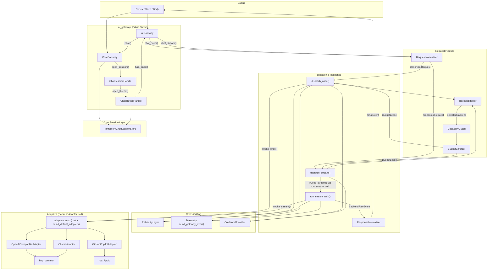

# AI Gateway — Topology

## Component Topology (Mermaid)

## Module Inventory

| File | Responsibility |
|---|---|
| `mod.rs` | Re-exports all sub-modules |
| `types.rs` | Backend config, profiles, credentials, budget/reliability/chat config |
| `types_chat.rs` | Beluna-domain chat types (`ChatRequest`, `BelunaMessage`) + canonical types (`CanonicalRequest`, `CanonicalMessage`), adapter event types |
| `error.rs` | `GatewayError` + `GatewayErrorKind` taxonomy |
| `gateway.rs` | `AIGateway` struct — owns pipeline, exposes `chat_once()` / `chat_stream()` + dispatch loops |
| `router.rs` | `BackendRouter` — resolves route alias → `SelectedBackend` |
| `request_normalizer.rs` | `ChatRequest` → `CanonicalRequest` validation + mapping |
| `response_normalizer.rs` | `BackendRawEvent` → `ChatEvent` trivial 1:1 mapping |
| `capabilities.rs` | `CapabilityGuard` — pre-flight assertion on backend capabilities |
| `credentials.rs` | `CredentialProvider` trait + `EnvCredentialProvider` |
| `budget.rs` | `BudgetEnforcer` — concurrency semaphore, rate token bucket, timeout clamping |
| `reliability.rs` | `ReliabilityLayer` — circuit breaker, retry policy, backoff |
| `telemetry.rs` | `GatewayTelemetryEvent` enum + `emit_gateway_event()` (tracing only) |
| `chat/mod.rs` | Re-exports Chat Session/Thread/Turn API |
| `chat/api.rs` | `ChatGateway` / `ChatSessionHandle` / `ChatThreadHandle` — OO session API |
| `chat/types.rs` | Session/thread/turn request/response DTOs |
| `chat/session_store.rs` | `InMemoryChatSessionStore` — in-memory session/thread state, context trimming |
| `adapters/mod.rs` | `BackendAdapter` trait + `build_default_adapters()` registry |
| `adapters/http_common.rs` | Shared wire-format helpers for OpenAI & Ollama (message/tool serialization, HTTP error mapping) |
| `adapters/openai_compatible/chat.rs` | OpenAI-compatible HTTP adapter (once + stream) |
| `adapters/ollama/chat.rs` | Ollama HTTP adapter (once + stream, NDJSON) |
| `adapters/github_copilot/chat.rs` | GitHub Copilot adapter (LSP child process) |
| `adapters/github_copilot/rpc.rs` | JSON-RPC over stdio for Copilot LS |

## Ownership Boundaries

- **Inbound**: Cortex, Stem, and Body Endpoints call `AIGateway` or `ChatGateway`.
- **Outbound**: Adapters own all network/process I/O to AI backends.
- **State**: `InMemoryChatSessionStore` is the only mutable state; it is process-scoped and non-persistent.
- **Configuration**: `AIGatewayConfig` (from `beluna.jsonc`) is read-once at construction.
