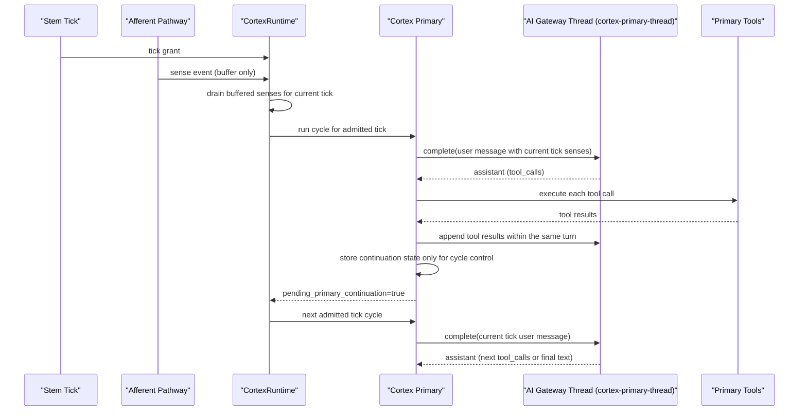
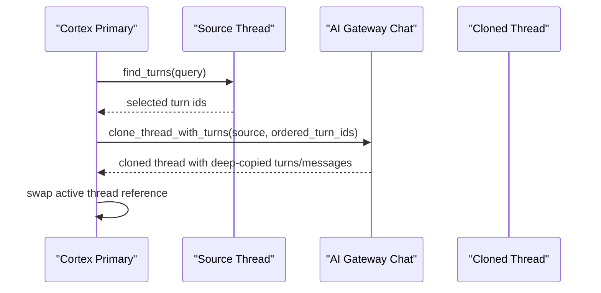

# Cortex Sequence

## Scope and Lifecycle

`cortex-primary-thread` is a long-lived AI Gateway thread (session/process scope).

A Cortex cycle is an admitted tick unit. It is not equal to thread lifetime.

## Normal Turn + Continuation

## Context Reset Path

## Post-Fix Invariants

1. Tool-call/result linkage is preserved inside a single turn.
2. Turn append/truncate operations keep the turn structurally complete at all times.
3. Cortex resets context by picking turns and cloning a new thread instead of mutating old thread history in place.

These keep cycle-driven execution while preserving a persistent chat thread.
