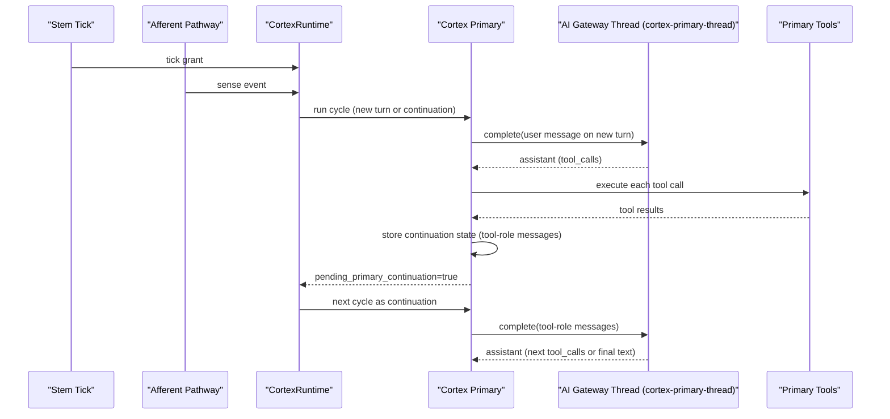
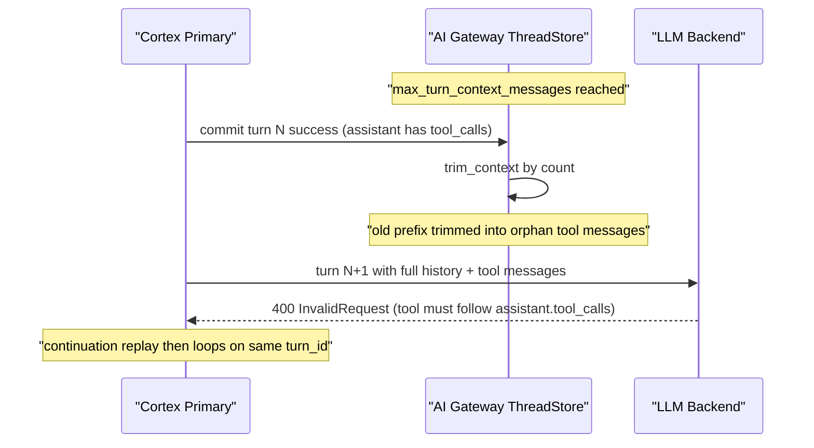

# Cortex Sequence

## Scope and Lifecycle

`cortex-primary-thread` is a long-lived AI Gateway thread (session/process scope).

A Cortex cycle is a runtime trigger unit (tick/sense/continuation). It is not equal to thread lifetime.

## Normal Turn + Continuation

## Failure Path (Observed 2026-03-03)

## Post-Fix Invariants

1. ThreadStore trimming removes leading orphan `tool` messages after compaction/mutation.
2. Thread preflight validates tool-message chain before backend dispatch.
3. Cortex Primary self-heals this error class by resetting continuation + primary thread state.

These keep cycle-driven execution while preserving a persistent chat thread.
