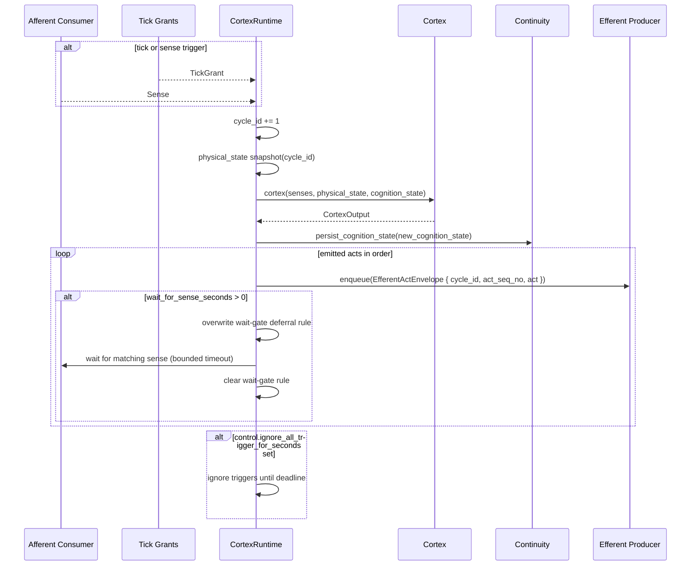

# Cortex Topography & Sequence

## Topography

Cortex is a stateless cognition boundary executed by `CortexRuntime`.

Runtime boundary:

```text
cortex(senses, physical_state, cognition_state) -> CortexOutput
```

`CortexOutput`:
1. `emitted_acts: Vec<EmittedAct>`
2. `new_cognition_state: CognitionState`
3. `control: CortexControlDirective`

`EmittedAct`:
1. `act`
2. `wait_for_sense_seconds` (`0` means no wait)
3. `expected_fq_sense_ids`

## Component Topography

```text
CortexRuntime (core/src/cortex/runtime.rs)
  ├─ reads physical snapshot via PhysicalStateReadPort
  ├─ drains afferent consumer + tick grants
  ├─ calls Cortex::cortex(...)
  ├─ persists cognition via Cortex->Continuity
  ├─ enqueues emitted acts into Stem efferent pathway
  └─ applies wait gate via afferent rule-control port while waiting for sense

Cortex Primary (core/src/cortex/primary.rs)
  ├─ deterministic input section assembly
  ├─ AI Gateway thread turn loop (streaming/tool-calling)
  ├─ structured internal tools
  ├─ dynamic per-act tool aliases -> fq act id mapping
  └─ returns emitted acts + control directives
```

## Primary Tools

1. Dynamic dedicated act tools (one tool per act descriptor).
2. `expand-senses`:
- `mode: raw | sub-agent`
- `senses_to_expand[].sense_id` format: `"<monotonic-id>. <fq-sense-id>"`.
3. `patch-goal-forest` (`reset_context` supported).
4. `overwrite-sense-deferral-rule`.
5. `reset-sense-deferral-rules`.
6. `sleep` (`ignore_all_trigger_for_seconds`).

## Input/Render Contracts

Senses delivered to Primary use deterministic lines:

```text
- [monotonic internal sense id]. [fq-sense-id]: [key=value,key=value,...]; [payload-truncated-if-needed]
```

Notes:
1. Payload is text.
2. Metadata fragment is deterministic key=value list.
3. Sense helper fallback may emit Postman envelope text for oversized payloads.

## Runtime Sequence



## File Map

```text
core/src/cortex/
├── mod.rs
├── runtime.rs
├── primary.rs
├── cognition.rs
├── cognition_patch.rs
├── ir.rs
├── prompts.rs
├── clamp.rs
├── error.rs
├── testing.rs
├── types.rs
└── helpers/
```
