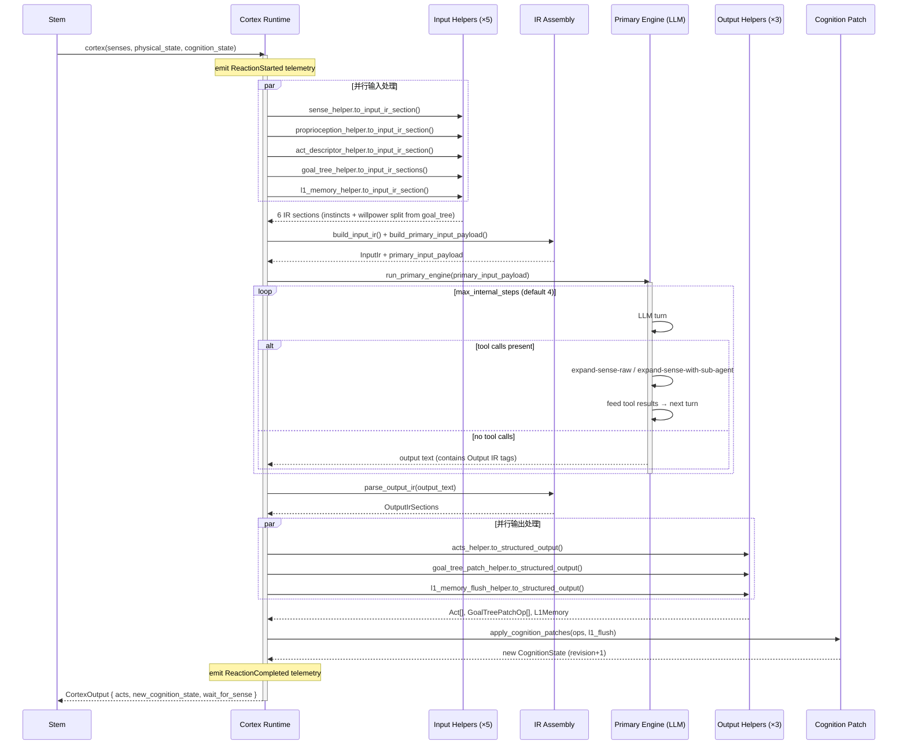
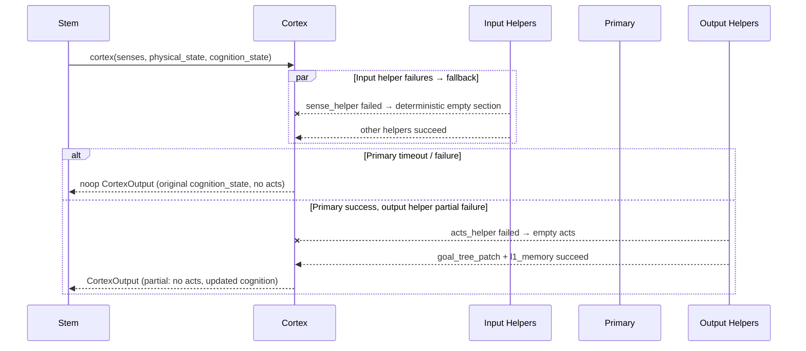
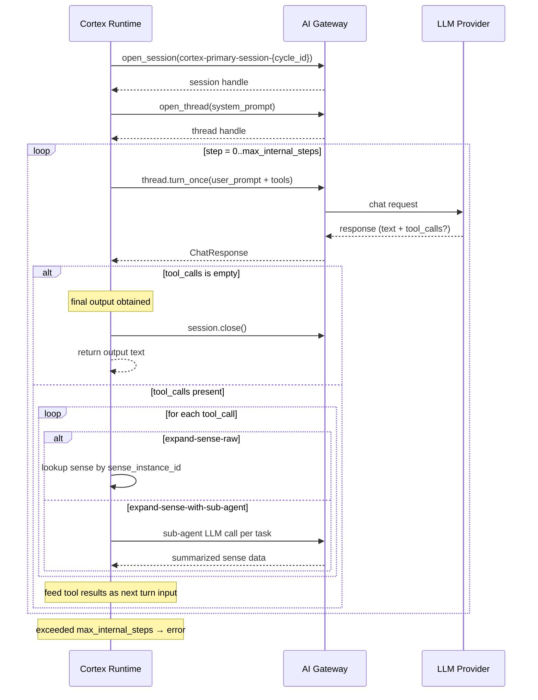

# Cortex Topography & Sequence

## Topography

Cortex 是无状态认知边界，纯函数签名：

```
cortex(senses, physical_state, cognition_state) -> (acts, new_cognition_state, wait_for_sense)
```

### 组件拓扑

```
                              ┌──────────────────────────────────────────┐
                              │              Cortex Runtime              │
                              │            (runtime.rs: Cortex)          │
                              │                                          │
  senses ──────────────────►  │  ┌─ Input Helpers (parallel) ──────────┐ │
  physical_state ──────────►  │  │  sense_input_helper                 │ │
  cognition_state ─────────►  │  │  proprioception_input_helper        │ │
                              │  │  act_descriptor_input_helper        │ │
                              │  │  goal_tree_input_helper             │ │
                              │  │  l1_memory_input_helper             │ │
                              │  └──────────────┬──────────────────────┘ │
                              │                 │ IR sections            │
                              │                 ▼                        │
                              │  ┌─ IR Assembly (ir.rs) ───────────────┐ │
                              │  │  build_input_ir()                   │ │
                              │  │  build_primary_input_payload()      │ │
                              │  └──────────────┬──────────────────────┘ │
                              │                 │ primary_input_payload  │
                              │                 ▼                        │
                              │  ┌─ Primary Engine ────────────────────┐ │
                              │  │  Cognitive Micro-loop               │ │
                              │  │  (max_internal_steps iterations)    │ │
                              │  │  ┌────────────────────────────┐     │ │
                              │  │  │ LLM turn ──► tool calls?   │     │ │
                              │  │  │   yes: expand-sense-raw /  │     │ │
                              │  │  │         expand-sense-with- │     │ │
                              │  │  │         sub-agent          │     │ │
                              │  │  │   no:  emit final output   │     │ │
                              │  │  └─────────────┬──────────────┘     │ │
                              │  └────────────────┼────────────────────┘ │
                              │                   │ primary_output text  │
                              │                   ▼                      │
                              │  ┌─ Output IR Parse (ir.rs) ───────────┐ │
                              │  │  parse_output_ir()                  │ │
                              │  │  -> OutputIrSections                │ │
                              │  └──────────────┬──────────────────────┘ │
                              │                 │ sections               │
                              │                 ▼                        │
                              │  ┌─ Output Helpers (parallel) ─────────┐ │
                              │  │  acts_output_helper                 │ │
                              │  │  goal_tree_patch_output_helper      │ │
                              │  │  l1_memory_flush_output_helper      │ │
                              │  └──────────────┬──────────────────────┘ │
                              │                 │ structured outputs     │
                              │                 ▼                        │
                              │  ┌─ Cognition Patch (cognition_patch.rs)│ │
                              │  │  apply_cognition_patches()          │ │
                              │  └──────────────┬──────────────────────┘ │
                              │                 │                        │
                              └─────────────────┼────────────────────────┘
                                                │
                                                ▼
                              CortexOutput { acts, new_cognition_state, wait_for_sense }
```

### 文件拓扑

```
cortex/
├── mod.rs                  公共导出
├── runtime.rs              运行时编排（Cortex struct + HelperRuntime impl）
├── cognition.rs            CognitionState, GoalTree, GoalNode, GoalTreePatchOp
├── cognition_patch.rs      apply_cognition_patches()
├── ir.rs                   Input/Output IR 构建与解析
├── prompts.rs              System/User prompt 模板
├── clamp.rs                act_instance_id 生成（UUIDv7）
├── error.rs                CortexError / CortexErrorKind
├── types.rs                CortexOutput, ReactionLimits, InputIr, OutputIr
├── testing.rs              TestHooks
├── AGENTS.md
└── helpers/
    ├── mod.rs                      CognitionOrgan enum, HelperRuntime trait, CortexHelper
    ├── sense_input_helper.rs       Sense → <somatic-senses> + SenseToolContext
    ├── proprioception_input_helper.rs  Proprioception → <proprioception>
    ├── act_descriptor_input_helper.rs  Descriptors → <somatic-act-descriptor-catalog>
    ├── goal_tree_input_helper.rs   GoalTree → <instincts> + <willpower-matrix>
    ├── l1_memory_input_helper.rs   L1Memory → <focal-awareness>
    ├── acts_output_helper.rs       <somatic-acts> → Act[]
    ├── goal_tree_patch_output_helper.rs  <willpower-matrix-patch> → GoalTreePatchOp[]
    └── l1_memory_flush_output_helper.rs  <new-focal-awareness> → L1Memory
```

### 依赖关系

```
Cortex ─────► AI Gateway (chat sessions/threads/turns)
Cortex ─────► Observability (metrics recording)
```

Cortex 不持有 Spine、Stem、Continuity 引用。它是纯函数调用，由 Stem 驱动。

---

## Sequence Diagram

### 正常认知周期



### 失败降级序列



### Primary 认知微循环详细序列


