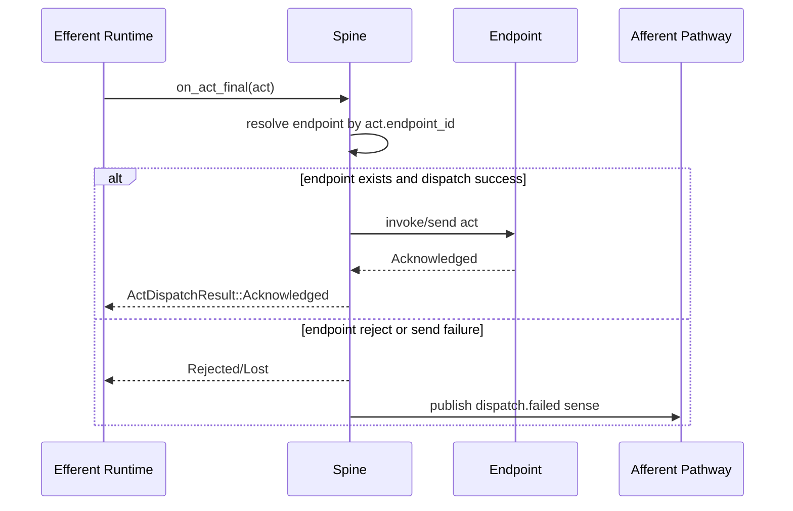

# Spine Topography & Sequence

## Topography

Spine is the execution substrate between runtime and body endpoints.

## Component Topography

```text
Spine Runtime (core/src/spine/runtime.rs)
  ├─ endpoint registry
  ├─ routing table by endpoint_id
  ├─ adapter channel ownership
  ├─ inline adapter runtime
  └─ unix-socket NDJSON adapter runtime

Dispatch path:
  on_act_final(act)
    -> dispatch_act(act)
      -> endpoint resolution
      -> invoke/send
      -> ActDispatchResult
      -> (on failure) emit dispatch.failed sense to afferent pathway

Control path:
  adapters -> Spine runtime control surface
    -> publish_sense/proprioception via SpineControlPort
    -> register/drop ns_descriptor via Spine runtime APIs
    -> for ns_descriptor: commit mutation in Stem first, then update Spine route index from accepted result
```

## External Wire Contract (UnixSocket NDJSON)

Auth ingress:

```json
{
  "method": "auth",
  "id": "uuid-v4",
  "timestamp": 1739500000000,
  "body": {
    "endpoint_name": "body.cli",
    "ns_descriptors": [],
    "proprioceptions": {}
  }
}
```

Sense ingress:

```json
{
  "method": "sense",
  "id": "uuid-v4",
  "timestamp": 1739500000000,
  "body": {
    "sense_instance_id": "uuid-v4",
    "neural_signal_descriptor_id": "user.message",
    "payload": "text",
    "weight": 1.0,
    "act_instance_id": "uuid-v7"
  }
}
```

Act ack ingress:

```json
{
  "method": "act_ack",
  "id": "uuid-v4",
  "timestamp": 1739500000000,
  "body": {
    "act_instance_id": "uuid-v7"
  }
}
```

## Dispatch Sequence


