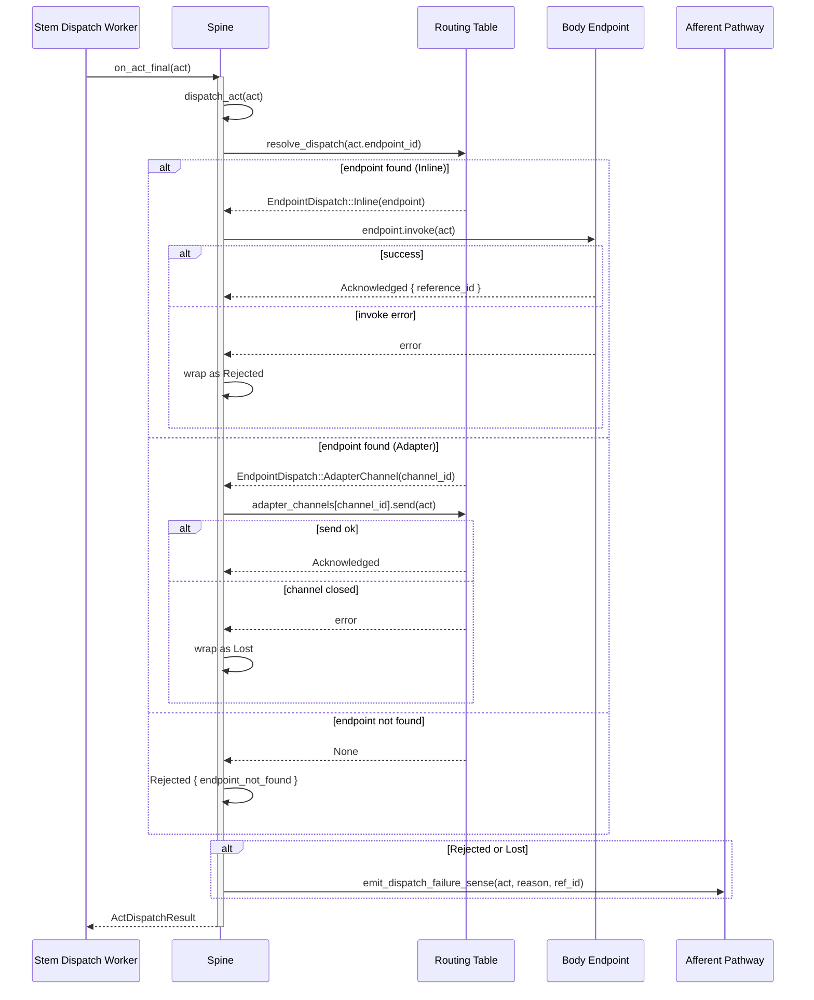
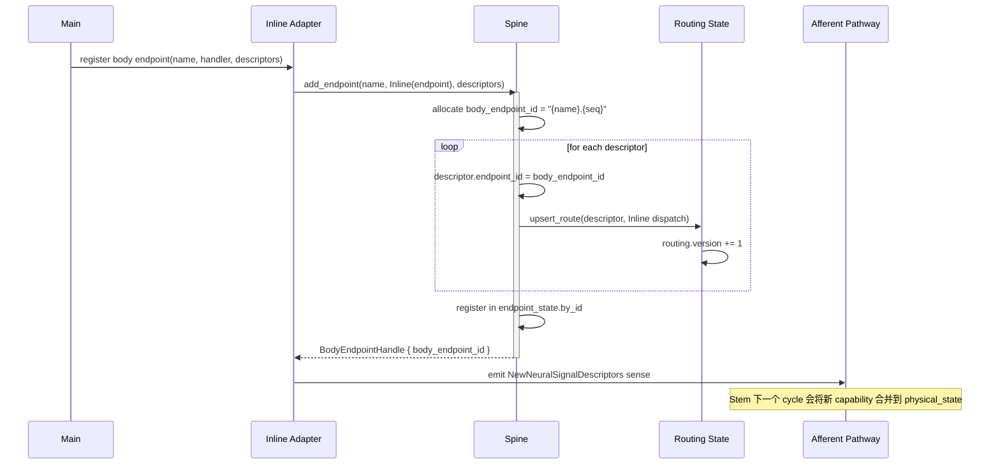
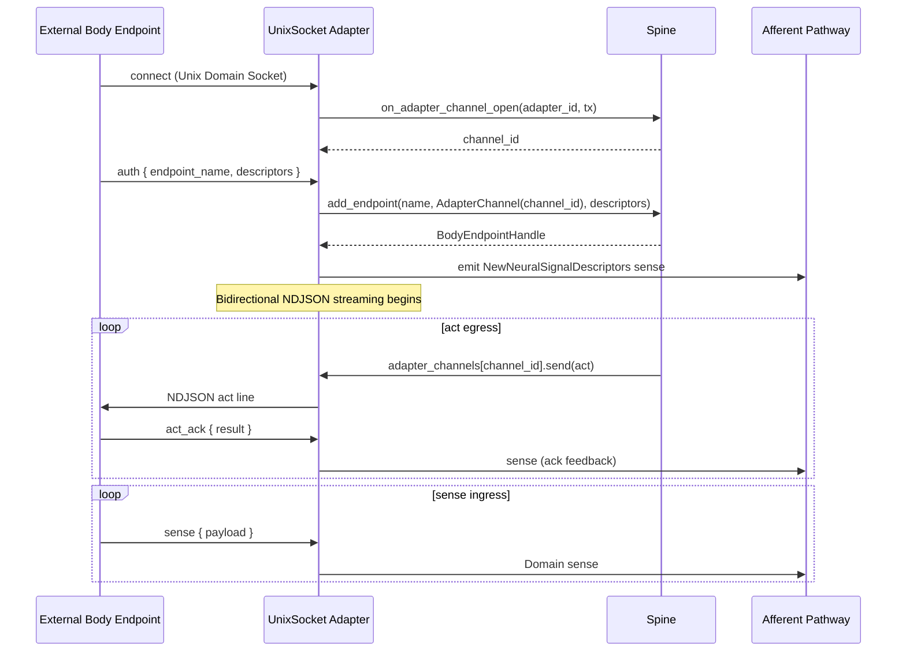
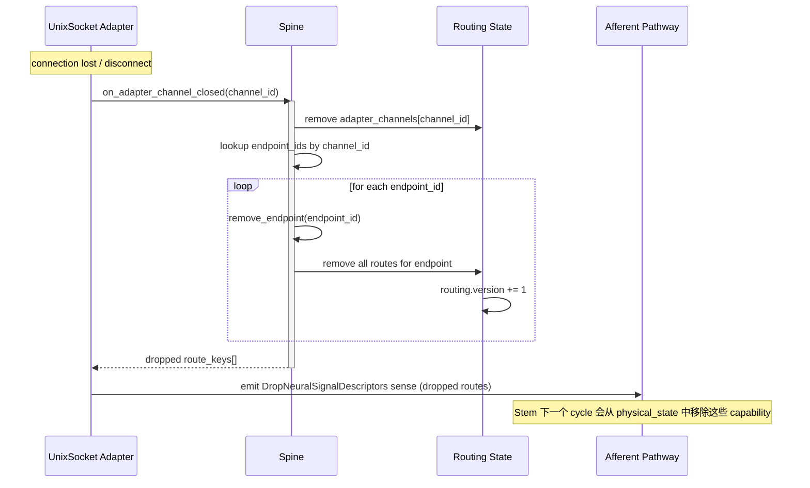
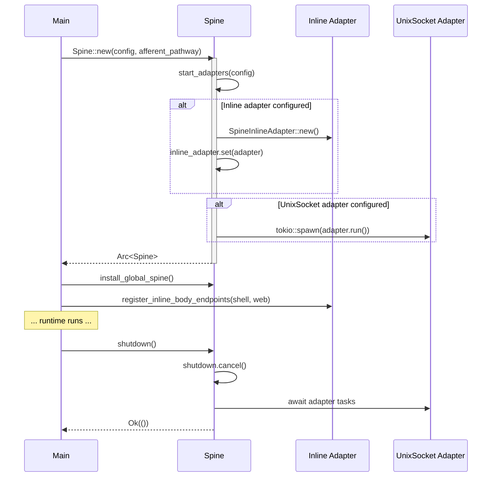

# Spine Topography & Sequence

## Topography

Spine 是执行底座，位于 Stem 与 Body Endpoints 之间，负责 act 路由分发和 body endpoint 生命周期管理。

### 组件拓扑

```
                    ┌──────────────────────────────────────────────────────────────────┐
                    │                        Spine Runtime                             │
                    │                    (spine/runtime.rs: Spine)                      │
                    │                                                                  │
                    │  ┌────────────────────────────────────────────────────────────┐   │
                    │  │                    Process Singleton                       │   │
                    │  │              (GLOBAL_SPINE: OnceLock<Arc<Spine>>)          │   │
                    │  └────────────────────────────────────────────────────────────┘   │
                    │                                                                  │
                    │  ┌─────────────────────┐    ┌──────────────────────────────┐     │
                    │  │   Routing State      │    │   Endpoint State             │     │
                    │  │   (RwLock)           │    │   (Mutex)                    │     │
                    │  │                     │    │                              │     │
                    │  │  by_endpoint:       │    │  by_id:                     │     │
                    │  │   endpoint_id →      │    │   endpoint_id →             │     │
                    │  │   {dispatch,         │    │   RegisteredBodyEndpoint    │     │
                    │  │    descriptors}      │    │                              │     │
                    │  │                     │    │  by_channel:                │     │
                    │  │  adapter_channels:  │    │   channel_id → {endpoint_ids}│     │
                    │  │   channel_id →      │    │                              │     │
                    │  │   mpsc::Sender<Act> │    │                              │     │
                    │  │                     │    │                              │     │
                    │  │  version: u64       │    │                              │     │
                    │  └─────────────────────┘    └──────────────────────────────┘     │
                    │                                                                  │
                    │  ┌───────────────────────────────────────────────────────────┐    │
                    │  │                      Adapters                             │    │
                    │  │                                                           │    │
                    │  │  ┌─────────────────────┐   ┌──────────────────────────┐   │    │
                    │  │  │  Inline Adapter      │   │  UnixSocket Adapter      │   │    │
                    │  │  │  (OnceLock, 唯一)    │   │  (tokio::spawn task)     │   │    │
                    │  │  │                     │   │                          │   │    │
                    │  │  │  In-process body    │   │  NDJSON over UDS:       │   │    │
                    │  │  │  endpoints:         │   │  auth → register        │   │    │
                    │  │  │  - shell            │   │  sense → ingress        │   │    │
                    │  │  │  - web              │   │  act → egress           │   │    │
                    │  │  │                     │   │  act_ack → ingress      │   │    │
                    │  │  └─────────────────────┘   └──────────────────────────┘   │    │
                    │  └───────────────────────────────────────────────────────────┘    │
                    │                                                                  │
                    │  ┌───────────────────────────────────────────────────────────┐    │
                    │  │                  Act Dispatch Pipeline                    │    │
                    │  │                                                           │    │
  act ───────────►  │  │  on_act_final(act)                                       │    │
                    │  │    │                                                      │    │
                    │  │    ▼                                                      │    │
                    │  │  dispatch_act(act)                                        │    │
                    │  │    ├─ resolve endpoint_id → EndpointDispatch              │    │
                    │  │    │                                                      │    │
                    │  │    ├─ Inline: endpoint.invoke(act)                        │    │
                    │  │    │   └─ → Acknowledged / Rejected                       │    │
                    │  │    │                                                      │    │
                    │  │    └─ Adapter: tx.send(act) → channel                     │    │
                    │  │        └─ → Acknowledged / Lost                           │    │
                    │  │                                                           │    │
                    │  │  on failure → emit_dispatch_failure_sense() ──► AP        │    │
                    │  └───────────────────────────────────────────────────────────┘    │
                    └──────────────────────────────────────────────────────────────────┘
                                                                          │
                                                                          ▼
                                                              Afferent Pathway
                                                          (dispatch failure senses)
```

### 文件拓扑

```
spine/
├── mod.rs              公共导出 + GLOBAL_SPINE singleton
├── runtime.rs          Spine struct, routing, dispatch, endpoint registry, adapter lifecycle
├── endpoint.rs         Endpoint trait + NativeFunctionEndpoint
├── error.rs            SpineError / SpineErrorKind
├── types.rs            ActDispatchResult, EndpointExecutionOutcome, SpineEvent, SpineExecutionMode
├── AGENTS.md
└── adapters/
    ├── mod.rs          re-exports
    ├── inline.rs       SpineInlineAdapter (in-process body endpoints)
    └── unix_socket.rs  UnixSocketAdapter (external body endpoints via UDS+NDJSON)
```

### 依赖关系

```
Spine
 ├──► Afferent Pathway     (emit dispatch failure senses, clone)
 ├──► Endpoint trait        (inline endpoints implement this)
 └──► Config               (SpineRuntimeConfig → adapter configs)

Spine is used by:
 ├── Stem (dispatch worker calls on_act_final)
 ├── Main (boot, register inline endpoints, shutdown)
 └── Adapters (internal: register/remove endpoints, publish capabilities)
```

### 路由模型

```
Act routing is endpoint_id-level only:

  act.endpoint_id  ──lookup──►  EndpointDispatch
                                  ├─ Inline(Arc<dyn Endpoint>)
                                  └─ AdapterChannel(channel_id)

Capability routing (neural_signal_descriptor_id) is delegated to endpoint internals.
```

### EndpointDispatch 结果

```
ActDispatchResult:
  ├─ Acknowledged { reference_id }     成功接收
  ├─ Rejected { reason_code, ref_id }  端点拒绝
  └─ Lost { reason_code, ref_id }      传输丢失
```

---

## Sequence Diagram

### Act 分发（完整路径）



### Body Endpoint 注册（inline）



### Body Endpoint 注册（外部 UnixSocket）



### Endpoint 断开与清理



### Spine 启动与关停


