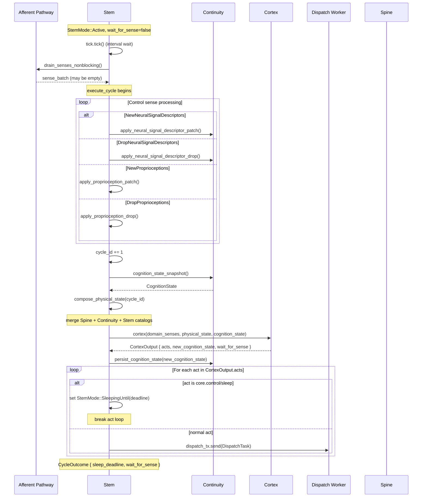
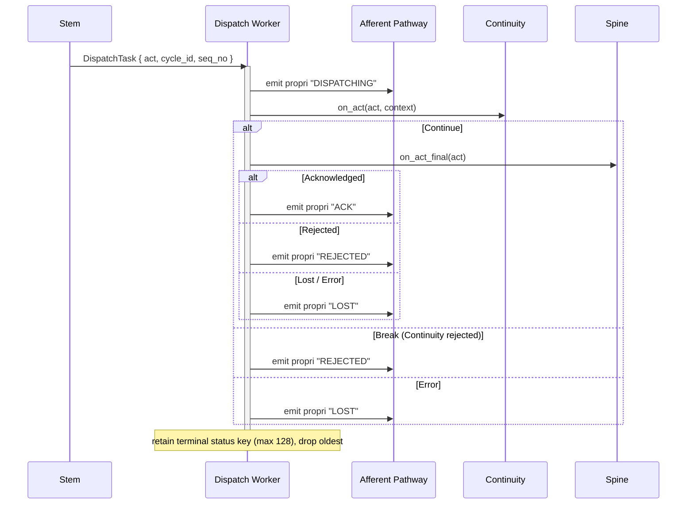
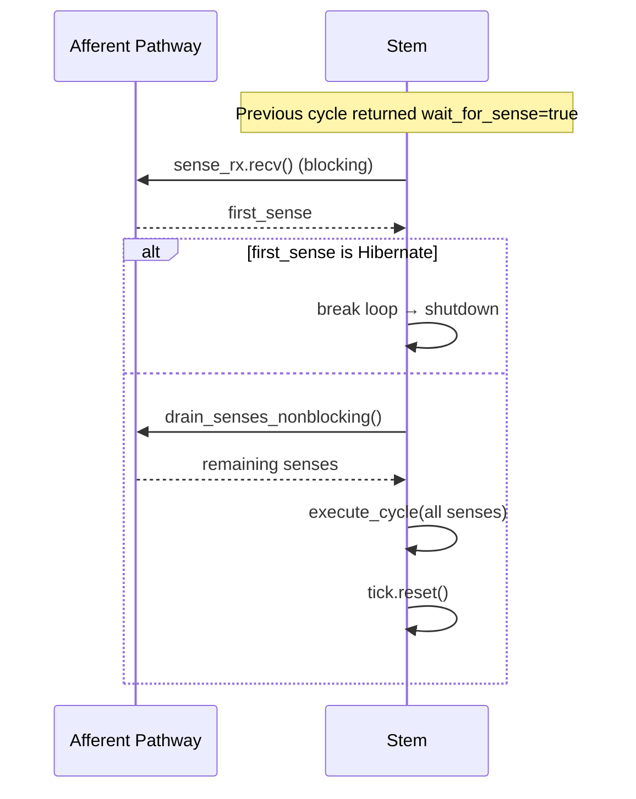
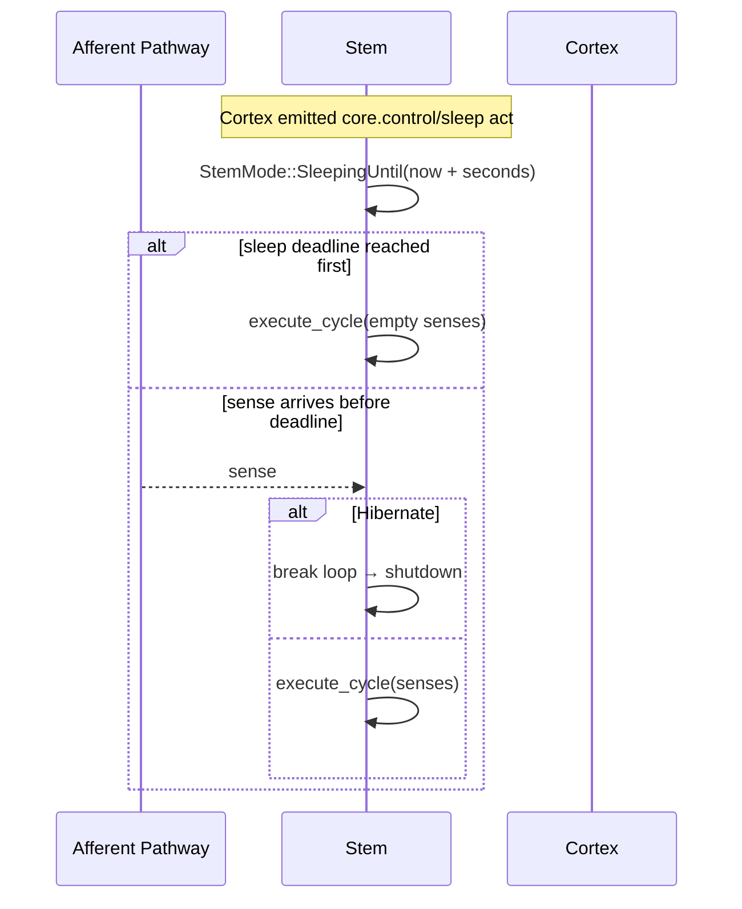
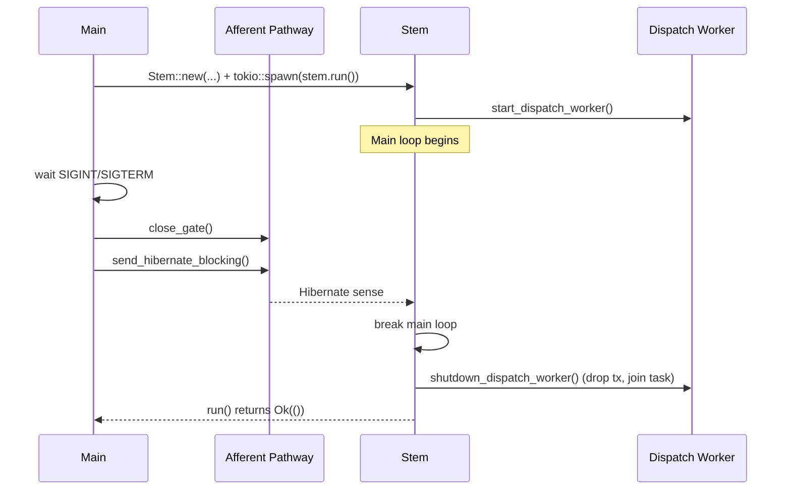

# Stem Topography & Sequence

## Topography

Stem 是 Beluna 核心运行时循环，负责 tick 调度、sense 摄入、Cortex 调用和串行 act 分发。

### 组件拓扑

```
                     ┌─────────────────────────────────────────────────────────────┐
                     │                      Stem Runtime                           │
 Afferent Pathway    │                      (stem.rs: Stem)                        │
══════════════════►  │                                                             │
 sense_rx (MPSC)     │  ┌─────────────────────────────────────────────────────┐    │
                     │  │               Main Loop (run)                       │    │
                     │  │                                                     │    │
                     │  │  StemMode::Active                                   │    │
                     │  │    ├─ wait_for_sense=true:  block on sense_rx.recv  │    │
                     │  │    └─ wait_for_sense=false: tick.tick() then drain   │    │
                     │  │                                                     │    │
                     │  │  StemMode::SleepingUntil(deadline)                  │    │
                     │  │    └─ select! { sleep(remaining) | sense_rx.recv }  │    │
                     │  │                                                     │    │
                     │  │  ──► execute_cycle(senses) ◄──                      │    │
                     │  │        │                                            │    │
                     │  │        ▼                                            │    │
                     │  │  ┌──────────────────────────┐                       │    │
                     │  │  │ 1. Apply control senses  │                       │    │
                     │  │  │    - NewNeuralSignal*     │                       │    │
                     │  │  │    - DropNeuralSignal*    │                       │    │
                     │  │  │    - New/DropProprioception│                      │    │
                     │  │  │ 2. cycle_id++             │                       │    │
                     │  │  │ 3. Compose physical_state │                       │    │
                     │  │  │ 4. Snapshot cognition     │                       │    │
                     │  │  │ 5. Cortex invocation      │──────►  Cortex       │    │
                     │  │  │ 6. Persist cognition      │──────►  Continuity   │    │
                     │  │  │ 7. Dispatch acts          │──────►  Dispatch Wkr │    │
                     │  │  └──────────────────────────┘                       │    │
                     │  └─────────────────────────────────────────────────────┘    │
                     │                                                             │
                     │  ┌─────────────────────────────────────────────────────┐    │
                     │  │           Dispatch Worker (async task)               │    │
                     │  │                                                     │    │
                     │  │  dispatch_rx.recv() loop:                           │    │
                     │  │    ┌───────────────────────────┐                    │    │
                     │  │    │ emit propri "DISPATCHING" │                    │    │
                     │  │    │ Continuity.on_act()       │──► Continue/Break  │    │
                     │  │    │   Break → REJECTED        │                    │    │
                     │  │    │   Error → LOST            │                    │    │
                     │  │    │   Continue ↓              │                    │    │
                     │  │    │ Spine.on_act_final()      │──► ACK/REJ/LOST   │    │
                     │  │    │ emit propri terminal stat │                    │    │
                     │  │    │ retain/drop status keys   │                    │    │
                     │  │    └───────────────────────────┘                    │    │
                     │  └─────────────────────────────────────────────────────┘    │
                     │                                                             │
                     │  Built-in: core.control/sleep act → StemMode::SleepingUntil │
                     └─────────────────────────────────────────────────────────────┘
```

### 文件拓扑

```
stem.rs                     Stem struct + run loop + execute_cycle + dispatch worker
afferent_pathway.rs         SenseAfferentPathway (gated MPSC sender wrapper)
```

### 依赖关系

```
Stem
 ├──► Cortex              (cortex() 调用, Arc<Cortex>)
 ├──► Continuity           (cognition snapshot/persist + on_act, Arc<Mutex<ContinuityEngine>>)
 ├──► Spine                (on_act_final dispatch, Arc<Spine>)
 └──► Afferent Pathway     (emit proprioception status patches, clone)
```

### 状态拓扑

```
Stem owns:
  cycle_id: u64                              单调递增周期号
  main_startup_proprioception: BTreeMap      启动时收集的只读系统属性
  dynamic_proprioception: BTreeMap           运行时动态属性（sense-driven）
  dispatch_tx / dispatch_task                分发工作线程通道与句柄
```

### Capability 合并

```
compose_physical_state() 合并三个 catalog:
  ┌─ Spine catalog          (body endpoint capabilities)
  ├─ Continuity catalog     (continuity-owned capabilities)
  └─ Stem catalog           (core.control/sleep)
  ────────────────────
  = merged NeuralSignalDescriptorCatalog (versioned)
```

---

## Sequence Diagram

### 正常 tick-driven 周期



### Act 分发序列



### wait_for_sense 模式



### Sleep 模式



### 启动与关停


