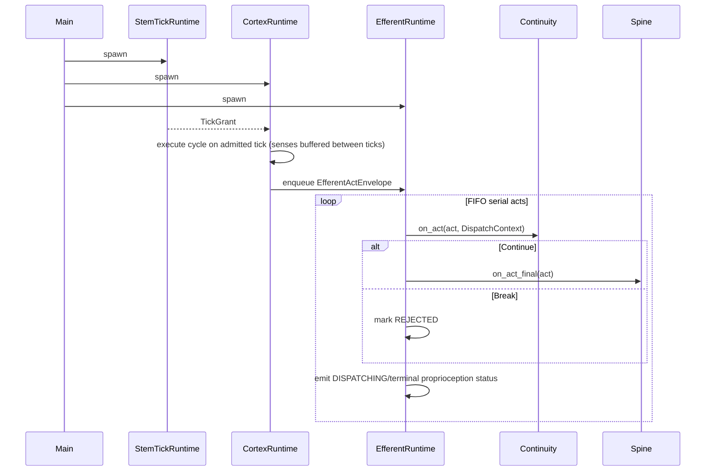
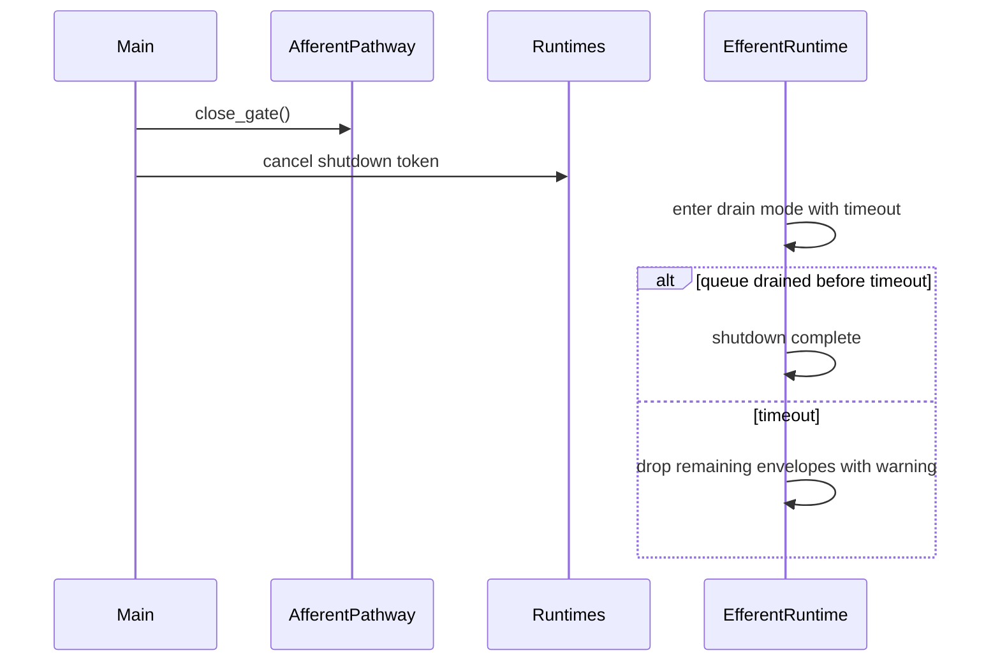

# Stem Topography & Sequence

## Topography

Stem owns:
1. pathway construction (`afferent`, `efferent`)
2. tick authority
3. physical-state write path.

Stem does not invoke Cortex.

## Component Topography

```text
Stem Tick Runtime (core/src/stem/runtime.rs)
  └─ emits TickGrant over bounded channel

Stem Physical State Store (core/src/stem/runtime.rs)
  ├─ canonical Arc<RwLock<PhysicalState>>
  └─ write surface: StemControlPort

Afferent Pathway (core/src/stem/afferent_pathway.rs)
  ├─ bounded ingress queue
  ├─ deferral scheduler
  ├─ rule control: overwrite/reset/snapshot
  └─ observe-only sidecar events

Efferent Pathway (core/src/stem/efferent_pathway.rs)
  ├─ bounded FIFO queue
  ├─ producer handle used by CortexRuntime
  └─ serial consumer pipeline: Continuity -> Spine
```

## Runtime Sequence



## Shutdown Sequence


