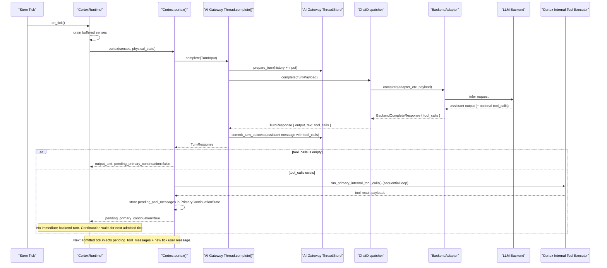
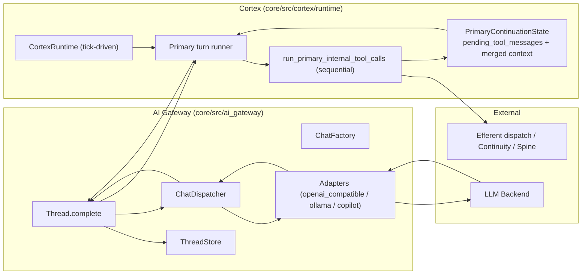

# AI Gateway Chat Tool Calls — Current State

## Scope

This document describes the current implementation of AI Gateway Chat tool-call flow, including where tool calls are parsed, where they are executed, and how continuation works with Cortex ticks.

## Current Sequence (Non-stream Turn)

## Current Topology (Tool-call Relevant)

## Responsibility Split Today

| Concern | Current Owner | Notes |
|---|---|---|
| Parse backend tool-call wire payload into structured calls | AI Gateway adapters | `parse_tool_calls_from_message(...)` in adapters |
| Keep assistant `tool_calls` in message history | AI Gateway Thread API + ThreadStore | Assistant message committed with `tool_calls` |
| Validate tool-message linkage before dispatch | AI Gateway Thread API | `validate_tool_message_chain(...)` |
| Execute tool calls (actual function invocation) | Cortex Primary | `run_primary_internal_tool_calls(...)` |
| Tool-call batch execution strategy | Cortex Primary | Sequential `for` loop |
| Continuation timing policy | CortexRuntime | Tick-admitted only (no immediate micro-turn) |

## Concrete Code Anchors

- AI Gateway turn orchestration: `core/src/ai_gateway/chat/api.rs`
- AI Gateway backend invocation and response mapping: `core/src/ai_gateway/chat/dispatcher.rs`
- Adapter tool-call parsing:
  - `core/src/ai_gateway/adapters/openai_compatible/chat.rs`
  - `core/src/ai_gateway/adapters/ollama/chat.rs`
- Cortex primary tool-call execution: `core/src/cortex/runtime/primary.rs`
- Tick gate / continuation admission: `core/src/cortex/runtime/mod.rs`

## Current Constraints Relevant to Parallelization

1. AI Gateway currently has no tool executor abstraction and does not invoke tools.
2. Tool execution logic depends on Cortex-local mutable state (`PrimaryTurnState`, goal-forest state, continuation state).
3. Continuation is already next-tick based in runtime behavior.
4. There is currently no uniqueness guard that forbids duplicated tool names within a single assistant tool-call batch.
