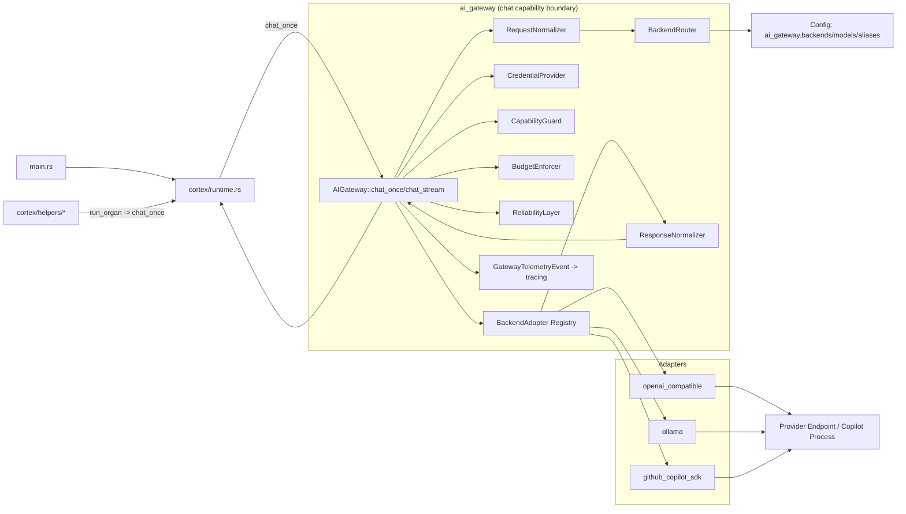
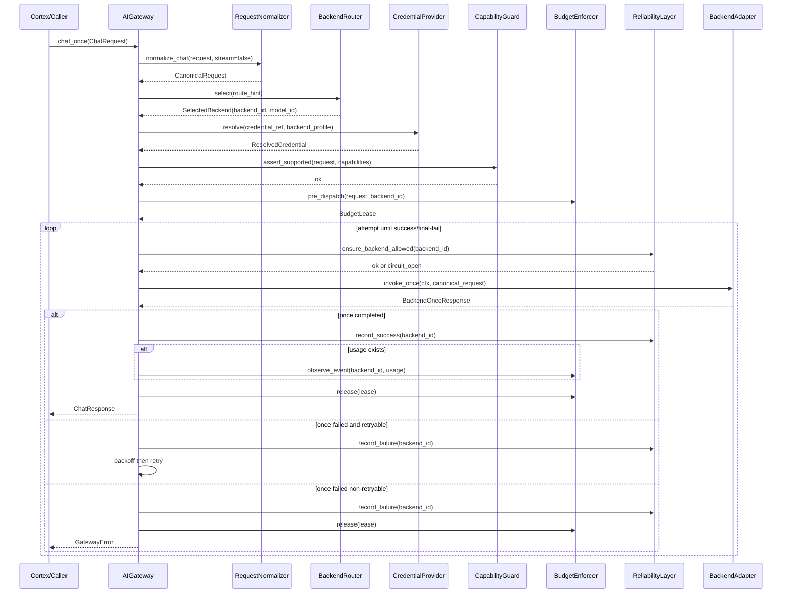
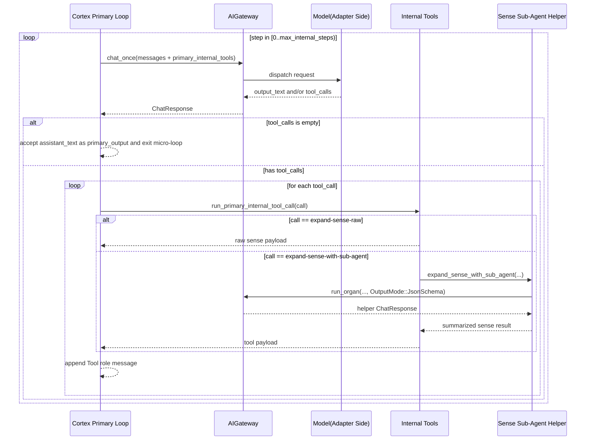

# AI Gateway 現況總結與探索計

> Last Updated: 2026-02-24  
> 旨：為 `ai-gateway` 下一輪大改先立「可驗之現況」，兼列探索次第。終以程式與測試為準。

## 1. 勘界

本次盤點所據，主在下列檔域：

- `core/src/ai_gateway/*`
- `core/src/cortex/runtime.rs`
- `core/src/cortex/helpers/*`
- `core/src/main.rs`
- `core/src/config.rs`
- `core/beluna.schema.json`
- `core/tests/ai_gateway/*`
- `beluna.jsonc`

## 2. 今制何如（Implementation Snapshot）

### 2.1 公門與主流程

`AIGateway` 今對外僅二門：

- `chat_stream(ChatRequest) -> Result<ChatEventStream, GatewayError>`
- `chat_once(ChatRequest) -> Result<ChatResponse, GatewayError>`

其內管線次第如左：

1. `RequestNormalizer::normalize_chat`（驗入參、轉 canonical）
2. `BackendRouter::select`（alias 或 `backend/model` 決一路）
3. `CredentialProvider::resolve`（解憑證）
4. `CapabilityGuard::assert_supported`（校能力）
5. `BudgetEnforcer::pre_dispatch`（時限/併發/平滑速率）
6. `ReliabilityLayer`（重試、退避、熔斷）
7. `chat_once`：走 `dispatch_once`，直調 `BackendAdapter::invoke_once`
8. `chat_stream`：走 `dispatch_stream`，調 `BackendAdapter::invoke_stream` + `ResponseNormalizer::map_raw`
9. `GatewayTelemetryEvent` 打點與 budget/reliability 結算

### 2.2 型別面

- 請求主型：`ChatRequest`（messages/tools/tool_choice/output_mode/limits/metadata/cost_attribution_id）
- 規範型：`CanonicalRequest`（含 `route_hint`, `stream`）
- 事件流：`ChatEvent::{Started, TextDelta, ToolCallDelta, ToolCallReady, Usage, Completed, Failed}`
- adapter once 響應：`BackendOnceResponse`
- 錯誤統一：`GatewayError` + `GatewayErrorKind`

### 2.3 路由與配置

- 配置採 backend-first：`ai_gateway.backends[].models[]`
- alias 置於 model 級：`models[].aliases`
- `default` alias 為硬性必備（`BackendRouter::new` 直檢）
- 路由輸入可為：
  - alias（如 `default`, `cortex_primary`）
  - 直指 `backend-id/model-id`
- 未命中 alias/backend/model，皆 fast fail；不作隱式 fallback

### 2.4 可靠性與預算

- Reliability：
  - `max_retries` + exponential backoff（含 jitter）
  - per-backend circuit breaker（failure streak + open window + probe）
  - 可否重試受輸出進度/工具事件/adapter 能力共同約束
- Budget：
  - dispatch 前檢 `max_output_tokens` 是否逾配置上限
  - per-backend semaphore 控併發
  - token bucket 平滑請求速率（可選）
  - `Usage` 逾額僅記錄 overage，不中止當前流（post-check）

### 2.5 Adapter 格局

- 目錄已改 provider-first：
  - `core/src/ai_gateway/adapters/openai_compatible/*`
  - `core/src/ai_gateway/adapters/ollama/*`
  - `core/src/ai_gateway/adapters/github_copilot/*`
- 三 adapter 皆實作 `invoke_once` 與 `invoke_stream`，`chat_once` 不再由 gateway 讀 stream 聚合。
- `openai_compatible`：SSE/JSON；支援 tool calls、json mode、json schema mode
- `ollama`：NDJSON；程式可解析 tool_calls，但 static capability 仍標 `tool_calls=false`
- `github_copilot_sdk`：以外部進程 + JSON-RPC 呼叫；每請求啟一子進程，取完成文本後即止
- 取消語義：多以 `AtomicBool` + adapter 自管 cancel handle

### 2.6 觀測

- gateway telemetry 事件：`RequestStarted/AttemptStarted/AttemptFailed/StreamFirstEvent/RequestCompleted/RequestFailed/RequestCancelled`
- `chat_once` 另有 `llm_input` / `llm_output` 與摘要日志
- `metadata["cortex_stage"]` 被 gateway 用於 stage 維度打點

## 3. Usage Sites（誰在用、如何用）

### 3.1 產線路徑（Runtime）

1. `core/src/main.rs`
- 開機時建單例 `AIGateway::new(config.ai_gateway, EnvCredentialProvider)`，注入 `Cortex`。

2. `core/src/cortex/runtime.rs`
- 真實調用皆走 `gateway.chat_once(...)`（目前產線未用 `chat_stream`）。
- 兩類主路：
  - `run_organ`：system+user 二訊息請求（helper/organ 通用）
  - `run_primary_micro_loop_turn`：primary 內循環，多輪 assistant/tool 回填後再問
- 其 `chat_once` 現已走 adapter 原生 once 路徑（非 stream 模擬）。
- route 來源：`cortex.helper_routes.<stage>`，無則 `helper_routes.default`。
- request metadata 固定帶 `cortex_stage`。
- `cost_attribution_id` 現皆置 `None`。
- `max_output_tokens` 目前在 runtime 被刻意暫停（固定傳 `None`）。

3. `core/src/cortex/helpers/*`
- 多個 helper 經 `runtime.run_organ` 間接調 gateway：
  - `sense_input_helper`（含 `expand_sense_with_sub_agent`）
  - `acts_output_helper`
  - `goal_tree_patch_output_helper`
  - `l1_memory_flush_output_helper`
  - `act_descriptor_input_helper`
  - `goal_tree_input_helper`

4. `cli/`、`apple-universal/`
- 目前未見直接依賴 `ai_gateway`（就現倉檢索）。

### 3.2 調用型態分佈

- 純文本輸出：primary、goal_tree_helper、act_descriptor_helper 等
- JSON Schema 輸出：acts/sense 子任務/goal_tree_patch/l1_memory_flush 等
- primary 已有「微循環 + tool call」雛形，惟循環狀態存於 `Cortex` 邏輯，非 `AIGateway` 一等能力

### 3.3 測試使用點

- `core/tests/ai_gateway/gateway_e2e.rs`：覆蓋 `chat_once`/`chat_stream`、重試、取消、預算後檢
- `core/tests/ai_gateway/router.rs`：alias 與直路由決策
- `core/tests/ai_gateway/openai_compatible.rs` / `ollama.rs` / `copilot_adapter.rs`：adapter 契約測試
- 其餘 `core/tests/ai_gateway/*`：normalizer/reliability/budget/adapter 契約

## 4. 就 Agent / 多輪支援之現況判讀

既有可用者：

- 請求 messages 可攜多輪歷史，且支援 assistant tool_calls + tool role 回傳。
- primary 內循環可在單 cycle 內做「LLM -> 工具 -> LLM」往復（受 `max_internal_steps` 限）。
- schema 化輸出在 helper 路徑已廣用。

尚缺或未升格者：

- gateway 無 session/thread 一等模型（僅單 request 流程）。
- gateway 不持久對話狀態；上下文拼接責任多在 `Cortex` 上層。
- tool orchestration 非 gateway 公共能力，現偏 cortex 私邏輯。
- 產線未用 `chat_stream`；流式與取消語義未在上層廣泛消化。
- `cost_attribution_id` 通道存在，然 runtime 尚未落實使用。

## 5. 重構前之關節風險（供下一步取捨）

1. `gateway.rs` 職責聚集，流控/重試/事件終止語義集中於單檔，改動耦合度高。  
2. 路由 alias 與 `helper_routes` 命名策略散於配置與調用方，易現隱性耦合。  
3. adapter 能力宣告與實際行為有偏差（例：ollama 對 tool_calls 之處理）。  
4. budget 的 usage overage 目前僅觀測，不參與即時裁決。  
5. copilot adapter 每請求起子進程，若轉 agent 長對話，成本與穩定性需另估。  

## 6. 探索計（Refactor Preparation Plan）

### Phase A：基線凍結（Current Baseline）

- 產出：
  - 本檔（現況與使用點）
  - 一份 call-graph（`main -> cortex -> ai_gateway -> adapters`）
- 完成判準：
  - 能逐行對應實際入口、出口、錯誤路徑

### Phase B：Usage Taxonomy（按場景分簇）

- 任務：
  - 將現有調用按 `primary/helper/sub-agent` 分群
  - 統計每群之 output mode、tool 使用、route 策略
  - 明確哪些場景需流式、哪些只需一次性
- 產出：
  - `USAGE.md`（已見 `./USAGE.md`）

### Phase C：Agent/多輪能力缺口建模

- 任務：
  - 定義「會話態」最小模型（session id, turn id, memory attachment, tool state）
  - 判定責任邊界：gateway 持何態、cortex 持何態
  - 評估是否將 primary 微循環泛化為 gateway 公共機制
- 產出：
  - `GAP.md`（能力差距 + 優先級）

### Phase D：目標介面草案

- 任務：
  - 在 `chat_*` 之上擬 agent-friendly API（不先寫碼，先對齊契約）
  - 明定事件模型是否需擴充（tool lifecycle、partial structured output、resume token）
  - 明定相容策略（本倉可不保舊，仍需明遷移步序）
- 產出：
  - `TARGET-API.md`（草案 + trade-off）

### Phase E：遷移與驗證設計

- 任務：
  - 切分可獨立提交之工作包（router/request/session/tool/adapter）
  - 先立「行為不退化」回歸清單（路由決定性、終止事件唯一性、取消釋放）
  - 補 agent/multi-turn 新增契約測試矩陣
- 產出：
  - `MIGRATION-PLAN.md`、`TEST-MATRIX.md`

## 7. 建議先答之設計問題

1. 會話狀態究竟歸 `AIGateway`、`Cortex`，抑或二者分持？  
2. 工具調度要否升為 gateway 能力（跨 organ 可復用）？  
3. 目標是否要求「單請求可續傳/可恢復」？若是，事件與 adapter 契約須先改。  
4. `chat_stream` 是否成為上層主路？若是，`Cortex` 需同步改寫消費模型。  
5. 成本歸因（`cost_attribution_id`）是否在本輪落地，抑或另案。  

## 8. Chat 能力拓撲圖（Topology）

拓撲要點：

- `chat` 能力之正面邊界，今專繫於 `AIGateway`（`chat_once/chat_stream`）。
- `Cortex` 為主要上游；helpers 皆由 `run_organ` 間接入 gateway。
- 路由、預算、可靠性、adapter 皆在 gateway 內聚，故重構時宜先拆責任面，再動協議面。

## 9. Chat 時序圖（Sequence）

### 9.1 通用 `chat_once` 時序

### 9.2 `primary` 微循環（含內部工具）時序

時序要點：

- `primary` 已具 agent-like 內循環，然其狀態機在 `Cortex`，未升格為 gateway 能力。
- `expand-sense-with-sub-agent` 會再入 `run_organ -> chat_once`，故形成「主循環內再嵌 LLM 子呼叫」。
- 若未來欲將多輪/工具編排下沉 gateway，當先決定狀態歸屬與遞迴呼叫治理（超時、預算、追蹤 id）。
