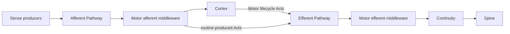
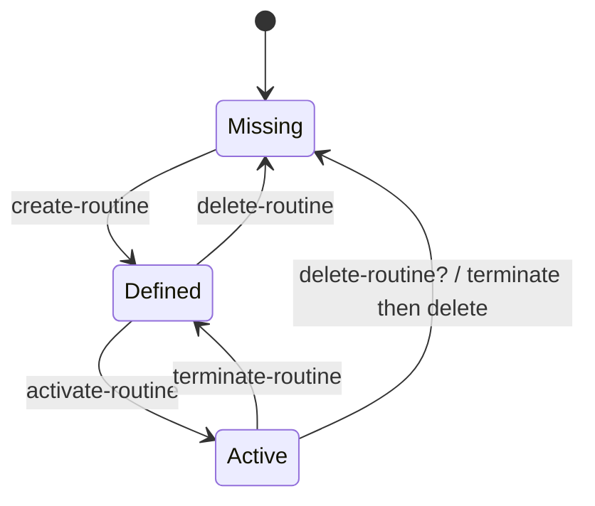

# Routine Reflex Model

> Last Updated: 2026-06-13
> Status: proposed correction

## Core Correction

The earlier model over-centered Motor on Efferent Pathway interception:

```text
Act -> Motor routine -> Vec<Act>
```

That is no longer the Motor operation model.

The corrected model:

```text
Sense + activation state -> active routine -> activation state + Acts
```

A routine is a Cortex-authored function that Motor activates as a mechanical
reflex path. Once active, the routine bypasses Cortex for selected procedural
reactions: it observes matched Senses and emits Acts.

Motor is therefore not primarily an Act expander. Motor is a middleware component
on both pathways:

- on the Afferent Pathway, Motor can call active routines with incoming Senses.
- routine returns are emitted as Acts into the Efferent Pathway.
- on the Efferent Pathway, Motor can handle Motor-targeted lifecycle Acts and
  pass through unrelated Acts.

## Unified Middleware Model

Cortex manages routines through built-in Motor Acts.

Minimum built-in Acts:

- `motor.create-routine`
- `motor.delete-routine`
- `motor.activate-routine`
- `motor.terminate-routine`

These Acts are still Neural Signals addressed to endpoint id `motor`.

They are not a separate control-plane model. They are simply Efferent Pathway
inputs that Motor's middleware position can handle to mutate its routine
registry or active routine set.

Motor's Efferent middleware role:

- handle Motor-targeted lifecycle Acts.
- validate and apply lifecycle changes.
- request Continuity persistence through Acts.
- emit lifecycle result Senses.
- pass through unrelated Acts.

Motor's Afferent middleware role:

- match incoming Senses against active routine selectors.
- call matching routines.
- store returned activation state.
- emit returned Acts into the Efferent Pathway.

Working shape:

```text
fn routine(state, sense) -> RoutineReaction
```

The active routine is selected by a Sense selector, not by a routine-specific Act
descriptor.

Motor owns the runtime mechanics:

- match incoming Senses against active routine selectors.
- invoke matching routine functions.
- emit returned Acts into the Efferent Pathway.
- correlate routine output with the triggering Sense and activation id.
- emit routine lifecycle / failure Senses when needed.

## Topology



The whole Motor component is middleware on both pathways. Active routines are
internal callbacks selected by Motor while processing Afferent Senses.

## Lifecycle



Open naming detail:

- `terminate-routine` matches the current user wording.
- `deactivate-routine` may be clearer if the routine definition remains stored.
- `terminate` may be better reserved for an active activation / invocation.

## Routine Definition

A persisted routine definition likely needs:

- `routine_id`
- `source`
- `dsl`
- `version`
- Sense selector metadata
- declared Act output shape or allowed endpoint / descriptor outputs
- optional routine-produced Sense descriptors

The Sense selector is first-class. Without it, an active routine has no clear
afferent attachment point.

## Activation State

"Routine is stateless" should not mean Motor has no state.

Current recommendation:

- routine source is pure.
- active routine instances are stateful through explicit activation state owned
  by Motor.
- the routine function receives current state and Sense, then returns next state
  and Acts.

This means:

- the routine definition has no persisted mutable state beyond source and
  metadata.
- Continuity persists routine definitions and lifecycle decisions.
- Motor does not persist activation / invocation frames for MVP.

Motor may still need non-persisted activation state:

- `activation_id`
- active selector set
- owner / scope metadata
- pending child Act ids
- cancellation flag
- observability lineage

This state belongs to Motor runtime, not to the routine source as durable memory.

See [ROUTINE-STATE.md](./ROUTINE-STATE.md).

## Descriptor Implications

The earlier "one routine maps 1:1 to one Motor Act Neural Signal" should be
reconsidered.

Under the reflex model, the durable control descriptors are built-in Motor Acts:

- create
- delete
- activate
- terminate

A routine itself does not need to become an Act descriptor merely to run. It runs
because it is active and its Sense selector matches incoming Senses.

Optional future feature:

- expose a routine-specific Motor Act descriptor for manual invocation or
  one-shot testing.

That should be treated as an extra surface, not the primary routine semantics.

## DSL Implications

This model weakens the need for coroutine-shaped `await_sense`.

The Motor runtime can provide the event loop:

1. A Sense enters the Afferent Pathway.
2. Motor matches active routine selectors.
3. Motor calls the routine with current activation state and Sense.
4. The routine returns next activation state and Acts.
5. Motor stores next state and emits those Acts.
6. Later endpoint feedback returns as new Senses and the same process repeats.

Therefore the MVP DSL can be an event-step or pure handler language:

```text
fn on_sense(state, sense) -> RoutineReaction
```

Rhai becomes stronger under this model because it is good enough for an embedded
event-step function. Nanolang's lack of Motor-visible suspension matters less,
unless the product still wants procedure-shaped routine source.

## Open Decisions

1. Should active routines only observe Senses, or may they consume / hide Senses
   before Cortex sees them?
2. What is the exact scope of activation: global, conversation, cycle, artifact,
   or explicit activation id?
3. Should `terminate-routine` be renamed to `deactivate-routine`, with
   `terminate` reserved for active invocation frames?
4. Should routine output be only `Vec<Act>`, or should routine-produced Senses be
   returned explicitly as `(Vec<Act>, Vec<Sense>)`?
5. Does deleting an active routine reject, implicitly terminate then delete, or
   require a separate terminate first?
6. How does Continuity persist routine definition, activation, termination, and
   deletion without Motor calling storage APIs directly?
7. Does Stem still need to register per-routine Neural Signals, or only built-in
   Motor lifecycle descriptors plus optional routine-produced Sense descriptors?
