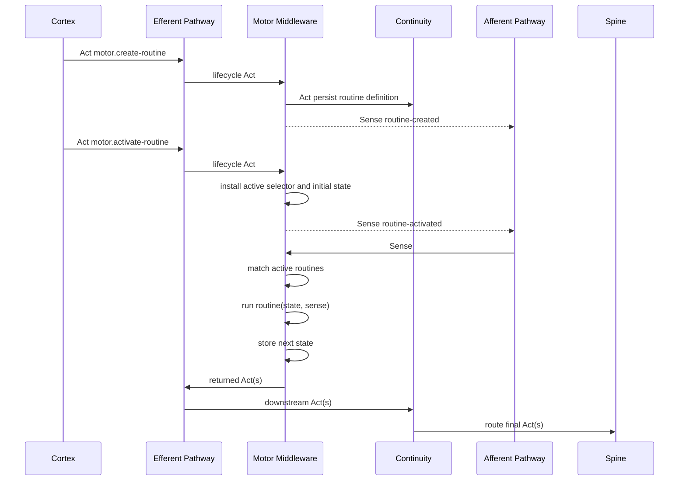

# Cortex / Motor Interaction Model

> Last Updated: 2026-06-13

## Core Claim

Cortex and Motor communicate through Neural Signals.

Cortex does not need a special Motor API.

Corrected model:

- Motor as a whole is middleware on both Efferent and Afferent Pathways.
- Efferent middleware lets Motor handle Motor-targeted lifecycle Acts and pass
  through unrelated Acts.
- Afferent middleware lets Motor call active routines with incoming Senses.
- Active routine return values become Acts emitted to the Efferent Pathway.

## Lifecycle Acts Are Not A Separate Plane

Cortex still needs to create, delete, activate, and terminate routines.

Minimum built-in Act descriptors:

- `motor.create-routine`
- `motor.delete-routine`
- `motor.activate-routine`
- `motor.terminate-routine`

These are Efferent Pathway inputs addressed to endpoint id `motor`.

They are not routine invocations and should not be modeled as the routine
execution contract.

Motor's Efferent middleware handles them to mutate:

- routine definitions.
- routine registry.
- active routine set.
- activation state.

## Active Routine Execution

Active routine execution is afferent-driven.

Working shape:

```text
matched Sense + current activation state
  -> routine function
  -> next activation state + Vec<Act>
```

This is where Motor replaces Cortex's thought loop for mechanical reactions.

The routine is selected by:

- active routine registry state.
- Sense selector metadata.
- optional activation scope.

## Sequence



## Routine-Produced Acts

Motor-produced procedural Acts are still Acts / Neural Signals.

They should carry lineage when the model has a place for it:

- producer = `motor`
- routine id
- activation id
- triggering Sense instance id
- child Act id
- Cortex cycle id when available

Implementation note:

- reusing the normal efferent queue is acceptable if Motor pass-through is
  loop-safe.
- Motor must avoid recursively treating its own routine-produced Acts as
  lifecycle Acts unless they are explicitly addressed to `motor`.

## Motor To Cortex: Afferent Feedback

Motor should not own generic accepted/rejected dispatch Senses.

Motor and routines may produce Senses through the Afferent Pathway.

Possible Motor / routine feedback:

- routine created
- routine create failed
- routine activated
- routine activation failed
- routine terminated
- routine deleted
- routine-specific progress
- routine-specific completion
- routine-specific failure

Generic accepted/rejected/failure payloads are owned by the Efferent Pathway and
apply across Motor, Continuity, Spine, Stem, and future middleware.

## Cortex Interruption

Cortex interrupts or revises Motor by emitting another Act addressed to endpoint
id `motor`.

Examples:

- `motor.terminate-routine`
- `motor.delete-routine`
- future `motor.update-routine`
- future `motor.inspect-routine`

These remain Neural Signal Acts from Cortex's point of view.

## Superseded Assumptions

Superseded:

- routine execution as `Act -> Vec<Act>`.
- a separate Motor "control plane" model.
- routine-specific Motor Act descriptors as the primary way to run routines.
- each routine needing to map 1:1 to one Motor Act Neural Signal merely to run.

Current routine execution model:

```text
Sense + activation state -> routine -> activation state + Acts
```

## Open Design Edges

1. Exact descriptor ids for lifecycle success and failure Senses.
2. Whether `terminate-routine` should be called `deactivate-routine`.
3. Whether activation is global or scoped by activation id, conversation,
   artifact, or cycle.
4. Whether Motor only observes matched Senses or can consume / transform them
   before Cortex sees them.
5. Exact Continuity-owned Acts for routine definition persistence and optional
   activation persistence.
6. Whether routine state is raw JSON, typed DSL values, or a restricted Motor
   state object.
